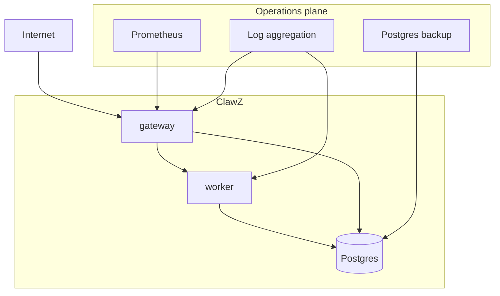
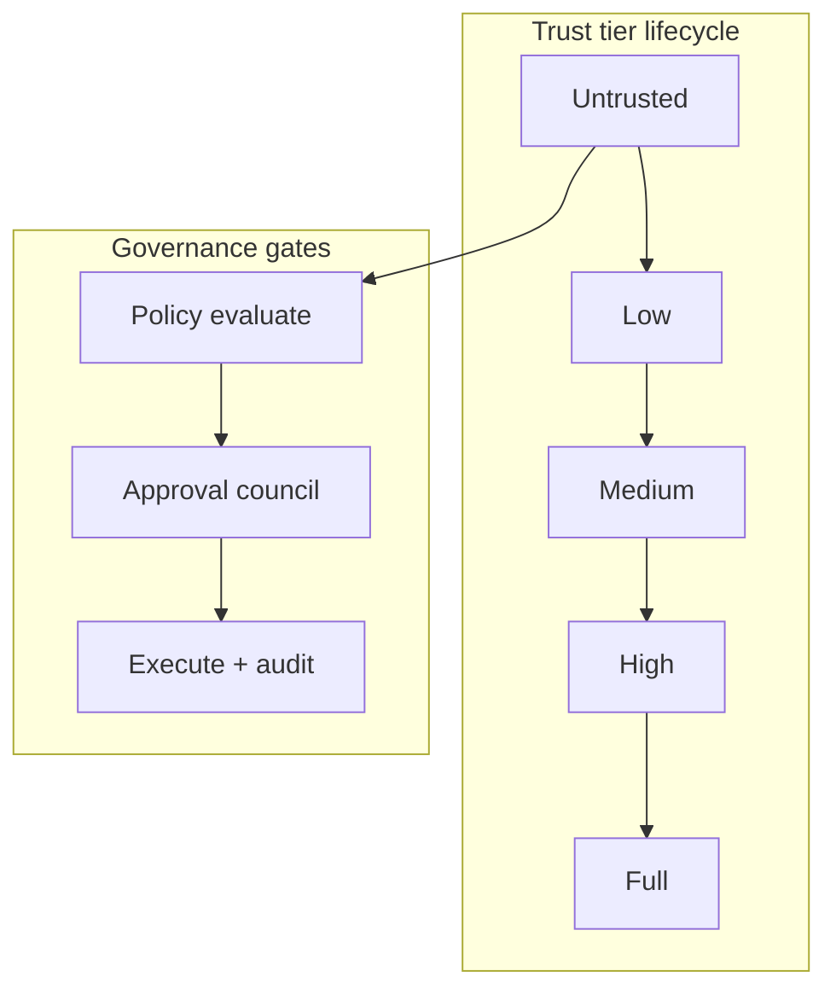
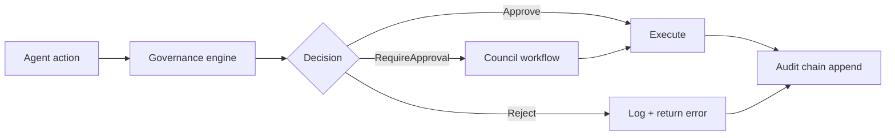
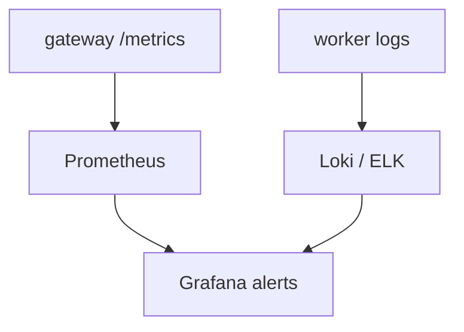
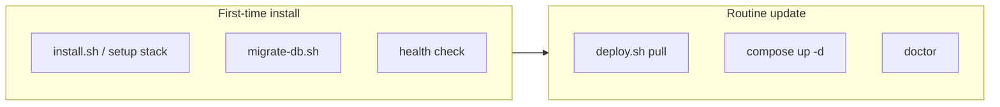

# ClawZ Administration Manual

**Version:** 1.0  
**Audience:** Platform administrators, SREs, security officers, and compliance leads  
**Companion documents:** [User Manual](user-manual.md) · [API Reference](api-reference.md) · [INSTALL.md](../INSTALL.md)

---

## 1. Overview

### Purpose

This manual describes how to govern, secure, deploy, and operate ClawZ in environments where downtime, data leakage, or unapproved autonomous actions have real consequences. It complements the User Manual by focusing on tenancy, infrastructure, auditability, and lifecycle management rather than day-to-day agent authoring.

### Product summary

ClawZ ships as open source under ELv2 with gateway and worker binaries, Docker Compose manifests, and optional prebuilt images on GHCR. Administration centers on Postgres durability, environment configuration, mesh networking in elastic mode, and the governance subsystem’s hash-chained audit log.

### Problem solved

Administrators need predictable installs, verifiable audit trails, and isolation between tenants and agents. ClawZ provides install scripts, setup APIs, Prometheus metrics, and PRISM-G enforcement so policy is not dependent on informal team norms alone.

### Target users

Primary readers are **platform administrators**, **SREs**, **security architects**, and **compliance officers**. Developers appear when configuring CI/CD or writing policies.

### Key capabilities

Multi-tenant API keys, RBAC roles, budget enforcement, leader election in elastic mode, eighteen cloud deploy adapters, backup of Postgres, and export of governance audit chains.

### Supported use cases

Self-hosted VPS, private cloud Kubernetes, MSP per-customer stacks, air-gapped staging with source builds, and hybrid setups where the gateway is public and workers run on private networks.

### Out of scope

Enterpryz does not operate a managed ClawZ SaaS in this repository. Administrators supply TLS certificates, database HA, and organizational policies.

---

## 2. Getting Started

### Prerequisites

Production administration assumes Docker or Kubernetes literacy, Postgres operations experience, and secret management (Vault, SSM, or sealed secrets). Rust toolchain is required only when building from source.

### Sign-up and workspace setup

There is no hosted control plane. Provision a VM or cluster, clone the repository, configure DNS for `CLAWZ_PUBLIC_URL`, and run `./scripts/install.sh` or `clawz setup stack`. Complete `/setup` or CLI onboard to initialize `~/.clawz` state and bootstrap tokens.

### First agent creation

Administrators often seed a **canary agent** with stub provider in staging, then disable stubs before production cutover. Document the canary agent id in runbooks.

### Quickstart tutorial

Install stack, run migrations via `scripts/migrate-db.sh`, verify `/health`, configure `VALID_API_KEYS` without disable-auth, register real providers, run `clawz doctor`, enable Prometheus scrape, and snapshot the database.

### Basic concepts

**Admission control** limits concurrent work. **Tenant router** sticky-routes tenants to workers in mesh mode. **Fleet** manages worker nodes and agent container images. **Governance policies** version and hot-reload.

### Sample workflow

An admin provisions micro Compose on a VPS, stores secrets in `.env` with restrictive permissions, configures Caddy for TLS, registers API keys per team, defines strict governance policies, enables daily Postgres backups, and monitors `/metrics` for error rates.

---

## 3. Product Architecture

### System overview

Administrative control planes are the gateway configuration surface, worker orchestration (Bollard), database, and observability stack. No separate “admin console” exists beyond the dashboard and APIs.

### Core components

Scale gateway replicas behind a load balancer with sticky sessions when using WebSocket rooms. Scale workers horizontally; ensure `WORKER_URL` routing in mesh mode via tenant router. Database remains the consistency bottleneck—size connection pools via `pool_size`.

### Agent lifecycle

Administrators care about container image tags (`CLAWZ_IMAGE_TAG`), agent container resource limits, and fleet caps (`CLAWZ_MAX_AGENTS`). Zombie containers should be reaped by orchestration health checks.

### Data flow

All persistent tenant data should include `tenant_id` in queries. Cross-tenant leakage is prevented by RBAC at the gateway and query discipline in repos—do not bypass repositories with ad hoc SQL.

### Model and provider architecture

Rotate provider API keys on schedule. Store keys encrypted. Use separate providers per environment. Circuit breaker tuning (failure thresholds, recovery timeout) lives in shared configuration.

### Integration architecture

Inbound webhooks require valid TLS and signature verification. Outbound integrations need egress allow lists from worker and agent containers.

---

## 4. AI Agent Concepts

### Agent roles

From an administration perspective, agent roles are not merely UX labels—they determine default trust tier, approval requirements, and which tools appear in allow lists. New agents should inherit **Untrusted** or **Low** trust until a probation period completes. Leaders in rooms may trigger orchestration that spawns subagents; each subagent consumes budget and audit volume. Document which organizational roles may create leaders versus participants.

### Instructions and prompts

Administrators publish org-wide prompt standards: prohibited content, mandatory disclaimers for regulated industries, and citation requirements when RAG is enabled. Changes to production prompts should pass change control. The setup wizard seeds identity files; production changes should flow through version-controlled `AGENTS.md` in the operator workspace or agent PATCH operations with recorded timestamps.

### Tools and actions

Every tool registration is a potential privilege escalation. Maintain an approved-tool catalog. Shell, Docker, browser, and MCP tools require explicit risk acceptance on shared workers. Governance policies should map `execute_tool` actions to PRISM-G **Infrastructure** and **Safety** dimensions with thresholds that deny by default for new agents.

### Memory and context

Retention policies belong to administrators: how long messages and embeddings persist, whether PII may be embedded, and which tenants share an index. pgvector dimension mismatches cause runtime failures—validate `pgvector_dimensions` against your embedding provider before cutover.

### Knowledge sources

Classify sources (public, internal confidential, customer data) and restrict ingestion paths accordingly. Connector credentials must be tenant-scoped. Reindex jobs should be scheduled off-peak with disk and CPU headroom monitored.

### Autonomy levels

Trust tiers are the administrative knob for autonomy. Define promotion criteria (successful runs, zero governance denials, human spot-checks). Full-trust agents should still emit audit entries; autonomy reduces approval friction, not observability.

### Human-in-the-loop

Configure council quorum, approver identities, and timeouts. Production financial or medical workflows should default to **RequireApproval** for destructive tools unless formally risk-accepted. Train operators on approval APIs and WebSocket `/ws/approvals` for real-time queues.

---

## 5. Features

### Chat and task execution

Administrators size gateway and worker replicas for expected concurrent runs. Admission control prevents overload—tune limits when customers report 429 responses during peak hours.

### Multi-step workflows

Fan-out and orchestration multiply provider cost. Set budgets and monitor cost histograms when enabling batch endpoints for many agents.

### Retrieval and knowledge base

Plan Postgres storage growth for embeddings. HNSW indexes require maintenance windows after large ingests. Verify backup size includes vector tables.

### Integrations

Enable `CLAWZ_CHANNEL_SUPERVISOR` and `CLAWZ_CHANNEL_PAIRING` deliberately; pairing reduces impersonation risk for DM channels. Each connector needs credentials rotated on schedule.

### Notifications

Outbound messaging may trigger telecom or messaging compliance (A2P 10DLC, WhatsApp templates). Administrators own registration with carriers, not ClawZ defaults.

### Collaboration

Rooms increase concurrent worker load. Scale workers before enabling large multi-agent rooms in production.

### Analytics and logs

Prometheus scrape intervals and log retention should meet your SLO evidence requirements. Export audit logs to SIEM where required.

---

## 6. User Guide

### Dashboard overview

Rebuild the web image when white-labeling. Ensure `/setup` is network-restricted after onboarding completes.

### Creating an agent

Provide tenants with API key issuance procedures. Disable stub provider (`CLAWZ_STUB_PROVIDER`) before granting customer access.

### Configuring behavior

Centralize approved models list. Block deprecated provider routes at registry configuration where supported.

### Running tasks

Document maximum message size and timeout expectations. Long autonomous sessions need worker memory limits aligned with container caps.

### Reviewing outputs

Grant compliance roles read-only API keys for audit and history endpoints without write access.

### Managing conversations

Implement retention jobs at the database layer; ClawZ stores data until you purge it.

### Exporting results

Automate nightly exports for regulated industries. Verify hash chain integrity on audit exports before legal submission.

---

## 7. Prompt and Behavior Design

### System prompts

Publish a security annex: no credentials in prompts, no instructions to bypass governance, mandatory escalation phrases.

### Prompt templates

Store templates in git with CODEOWNERS review. Tie template versions to agent metadata where possible.

### Variables and placeholders

If integrations substitute variables, document injection rules to prevent prompt injection from end-user content.

### Response formatting

Require structured outputs only when parsers exist; malformed JSON should not crash pipelines.

### Fallback behavior

Org policy should mandate safe defaults on provider outage—queue for human review rather than silent failure.

### Escalation rules

Map escalation to on-call rotations outside ClawZ when governance approvals time out.

### Prompt versioning

Include prompt version in change tickets. Roll back agent records if evaluation regressions appear post-deploy.

---

## 8. Knowledge Base

### Data sources

Maintain a data inventory: which connectors feed which tenants and whether data may leave jurisdiction.

### File ingestion

Sandbox paths on workers; read-only root filesystem where Docker policy allows.

### Connectors

Rotate OAuth refresh tokens. Monitor connector error rates in logs.

### Indexing and sync

Schedule reindex during maintenance windows. Alert on embedding job failures.

### Retrieval settings

Tune top-k and thresholds in staging with golden questions before production promotion.

### Chunking and embeddings

Standardize embedding model per environment; mixing models invalidates indexes.

### Freshness and update policy

Define maximum staleness SLAs and enforce with automated sync plus quarterly audits.

---

## 9. Tools and Integrations

### Supported integrations

Review connector list each release for new egress destinations; update firewall rules accordingly.

### Authentication setup

Require `CLAWZ_SECRETS_KEY` in production for encrypted secret storage.

### Permissions

Separate worker pools for untrusted tool-heavy workloads versus trusted chat-only agents if feasible.

### Action schemas

Reject tool registrations with overly broad parameters in production namespaces.

### Webhooks

Terminate TLS at ingress; validate Twilio and provider signatures at the gateway.

### API connectors

Issue per-integration API keys with least-privilege roles.

### Failure handling

Alert on circuit breaker open state; tune thresholds per provider SLA.

---

## 10. Workflows and Automation

### Trigger types

Inventory all triggers (cron, webhooks, channels) in a runbook—each is a potential wake-up call for agents.

### Workflow builder

Code-defined workflows require the same review process as application deploys.

### Approval steps

Test governance policies in staging with deliberate deny scenarios before production.

### Scheduled runs

Audit cron job payloads for privilege escalation (e.g., agents running shell tools on schedule).

### Event-driven runs

Verify webhook endpoints are not exposed without signature checks.

### Retry logic

Cap retries to avoid runaway spend on failing provider calls.

### Exception handling

Ensure rollback handlers are enabled for multi-step pipelines that mutate external systems.

---

## 11. Administration

### Workspace settings

Operator workspace paths default to `~/.clawz/workspace` with `AGENTS.md` and skills. `CLAWZ_HOME` overrides the base directory. Session state for the wizard lives in `~/.clawz/setup/session.json`; bootstrap tokens in `setup/bootstrap.token` or `CLAWZ_SETUP_BOOTSTRAP_TOKEN`.

### Team and roles

API keys encode `hash:user_id:role:tenant_id`. Roles include owner, agent, and custom strings interpreted by handlers. JWT claims carry `tenant_id` for dashboard users. Document your role matrix externally.

### Access control

Disable `CLAWZ_DISABLE_AUTH` in production. Enforce TLS 1.3 at the ingress proxy. Restrict admin API keys to bastion hosts. Mesh firewall rules limit node-to-node traffic in elastic mode.

### Usage policies

Define org policies for acceptable agent use. Enforce budgets via cost repository daily and monthly limits. Sub-lease budgets to team agents through parent-child relationships in team coordinator configuration.

### Tenant settings

Set `CLAWZ_TENANT_ID` on gateway instances serving a dedicated customer, or rely on per-key tenant fields for multi-tenant single gateway. Database rows must carry tenant identifiers consistently.

### Branding

Dashboard branding uses assets in `web/public/branding/`. Customize for white-label deployments by rebuilding the web image.

### Audit controls

Governance audit entries form a SHA-256 chain. Verify integrity before legal submission. Export entries via `GET /api/v1/governance/audit` with appropriate credentials.

---

## 12. Security and Privacy

### Data handling

Postgres holds messages, embeddings, API keys, and audit data. Classify accordingly. Minimize PII in prompts and logs. Use redaction in log pipelines.

### Encryption

Encrypt Postgres volumes at rest (LUKS, EBS, or cloud KMS). TLS in transit terminates at your proxy. `CLAWZ_SECRETS_KEY` enables AES-256-GCM for stored provider secrets.

### Authentication and SSO

Native JWT login exists at `/api/v1/system/auth/login`. WebAuthn endpoint is available for passwordless flows where configured. Enterprise SSO typically fronts the dashboard with an identity proxy that mints JWTs—document your integration pattern.

### Authorization

Every protected route passes through `auth_middleware`. Public routes are limited to health, setup (partial), and signed webhooks.

### Secrets management

Never commit `.env`. Rotate `CLAWZ_JWT_SECRET`, `CLAWZ_WORKER_TOKEN`, and provider keys on compromise. Use separate secrets per environment.

### Data retention

Define retention windows per tenant. Implement purge scripts on messages and embeddings. Audit logs may need longer retention—immutable storage recommended.

### Privacy controls

Support data subject requests through deletion in Postgres and workspace file removal. Document subprocessors (OpenAI, Anthropic, etc.) when using cloud LLMs.

### Compliance notes

ClawZ provides technical controls aligned with SOC 2, GDPR, and EU AI Act workflows; certification requires your broader control environment. Export compliance reports from governance module where implemented.

---

## 13. Safety and Guardrails

### Allowed actions

Define allow lists per policy: which tools, which HTTP domains, which channel types.

### Restricted actions

Block shell, Docker, or browser tools for untrusted tiers. Deny cross-tenant data access at policy level.

### Content filtering

Configure output constraints in governance guardrails. Pair with model-level moderation APIs where required.

### Tool-use guardrails

PRISM-G **Infrastructure** dimension enforces resource bounds. Tool calls pass through the same governance engine as messages.

### Rate limits

Provider rate limits and gateway admission protect shared infrastructure. Tune mesh gossip and heartbeat intervals in elastic mode.

### Human approval gates

Configure council quorum and approver lists. Untrusted agents always require approval for destructive tools.

### Abuse prevention

Monitor for anomalous API key usage. Revoke keys immediately on leak. Use pairing for DM channels.

---

## 14. Model Management

### Supported models

Determined by registered providers. Document approved model list per environment.

### Model selection rules

Route agents to approved models only. Block deprecated models at provider registry.

### Temperature and parameters

Set per provider adapter defaults. Override in agent config where exposed.

### Provider failover

Runbooks should describe switching provider id on agents during outage.

### Token limits

Enforce via model choice and pipeline truncation. Budget enforcement rejects over-limit spend.

### Cost controls

`CostRepo` tracks spend. Configure daily and monthly caps. Review cost histogram metrics.

### Version changes

Track OpenAI/Anthropic deprecations. Test in staging before production routing changes.

---

## 15. Evaluation and Quality

### Success metrics

Define SLOs: availability, p95 latency, governance rejection rate, human escalation rate.

### Evaluation datasets

Curate golden questions with expected citations. Run after prompt or RAG changes.

### Test cases

Automate smoke tests against `/health` and sample agent runs in CI.

### Accuracy checks

Human review sample of production transcripts weekly.

### Hallucination checks

Require citation to retrieved chunks for regulated answers.

### Latency benchmarks

Measure end-to-end from API to first token. Track provider latency separately.

### Regression testing

Gate releases with `cargo test --workspace` and compose-smoke scripts.

---

## 16. Monitoring and Observability

### Usage dashboards

Dashboard overview routes aggregate counts. Build Grafana boards from Prometheus metrics.

### Execution logs

Aggregate gateway and worker logs with trace ids. Correlate with audit entry ids.

### Trace views

OpenTelemetry W3C context propagates to containers when enabled in worker observability module.

### Error tracking

Alert on 5xx rates, circuit open events, and migration failures.

### Alerting

Page on gateway unhealthy, worker unreachable, disk full on Postgres, and budget exceeded spikes.

### Cost monitoring

Export cost metrics to finance tools. Tag by tenant and agent.

### Performance monitoring

Watch connection pool saturation, pgvector query latency, and container spawn times.

---

## 17. API Documentation

Administrators manage keys, policies, and fleet via API. See [api-reference.md](api-reference.md). Restrict setup bootstrap routes to initial provisioning networks.

---

## 18. Deployment and Environments

### Environment setup

Maintain dev, staging, and prod with separate databases and keys. Never share `CLAWZ_WORKER_TOKEN` across environments.

### Configuration variables

Reference `.env.example` and `CLAWZ__SECTION__KEY` overrides. Document environment-specific TOML in `CLAWZ_CONFIG`.

### Dev, staging, prod

Dev may use `CLAWZ_DISABLE_AUTH=1` and stub provider. Staging mirrors prod with scrubbed data. Prod requires TLS, real auth, and backups.

### Hosting model

Single VPS Compose is valid for small teams. Kubernetes suits larger fleets. Elastic mode adds mesh for multi-node.

### Release process

Pull new images with `./scripts/deploy.sh` rather than rebuilding on every `git pull`. Pin `CLAWZ_IMAGE_TAG` to release tags.

### Rollback plan

Keep previous image tags. Restore Postgres snapshot if migrations fail. Document gateway-worker compatibility matrix per release.

### Infrastructure dependencies

Postgres 15+ with pgvector, Docker socket on workers for fleet mode, outbound HTTPS to LLM providers, inbound HTTPS for webhooks.

Host bootstrap architecture is documented in [superpowers/specs/2026-05-30-docker-bootstrap-compose-deploy-plan.md](superpowers/specs/2026-05-30-docker-bootstrap-compose-deploy-plan.md).

---

## 19. Troubleshooting

### Common issues

Gateway unhealthy often means database not ready or port conflict. Worker connection errors mean token mismatch or wrong `WORKER_URL`.

### Agent not responding

Check worker logs, agent container status, and governance denials.

### Incorrect answers

Usually prompt or RAG staleness—not a platform bug. Verify embeddings refreshed.

### Tool failures

Inspect sandbox permissions and circuit breaker state.

### Sync delays

Channel polling interval and supervisor backlog. Verify webhook delivery.

### Permission errors

API key tenant must match resource tenant.

### Debug checklist

Run `clawz doctor`, `docker compose ps`, `curl /health`, verify migrations applied, inspect governance audit for denials, confirm provider key valid.

---

## 20. Support and Operations

### Support channels

GitHub issues for community. Enterprise agreements with Enterpryz for production SLAs.

### SLAs

Self-defined for self-hosted. Document RTO/RPO for Postgres.

### Incident response

Rotate keys on breach. Scale workers on load. Fail over DNS to standby gateway.

### Maintenance windows

Announce before migrations. Use read-only mode if you implement gateway maintenance flag externally.

### Backup and recovery

Daily Postgres logical backups minimum. Test restore quarterly. Preserve audit chain immutability.

### Business continuity

Multi-AZ database, redundant workers, documented runbooks. Elastic mesh supports node loss with leader election.

---

## 21. Governance and Compliance

### Policy ownership

Security and compliance own PRISM-G policy JSON. Engineering implements and tests policies in staging.

### Responsible AI guidelines

Align PRISM-G dimensions with organizational AI principles. Document human oversight requirements.

### Risk register

Track model vendor risk, tool escape risk, and data exfiltration via prompts.

### Audit trail

Hash chain verification detects tampering. Include audit exports in SOC evidence packages.

### Regional data considerations

Choose LLM regions and data residency consciously. Postgres location is your choice.

### Legal disclaimers

Agents are not legal advisors. Telephony requires regulatory compliance for outbound calls and recording.

---

## 22. Release Notes and Change Log

Follow GitHub releases. Read migration SQL before upgrade. Breaking API changes will appear in release notes. Known issues tracked in repository issues.

---

## 23. Glossary and Reference

**Admission controller:** gateway component limiting load. **Bollard:** Docker API client for fleet. **ELv2:** Elastic License 2.0. **Fleet:** worker-managed agent containers. **PRISM-G:** Purpose, Reality, Infrastructure, Swarm, Memory, Governance. **pgvector:** Postgres extension for embeddings.

Configuration reference: see README Environment Variables table. Limits: `CLAWZ_MAX_AGENTS`, connection pool default 20, gossip interval configurable in mesh config.

---

*End of Administration Manual.*
