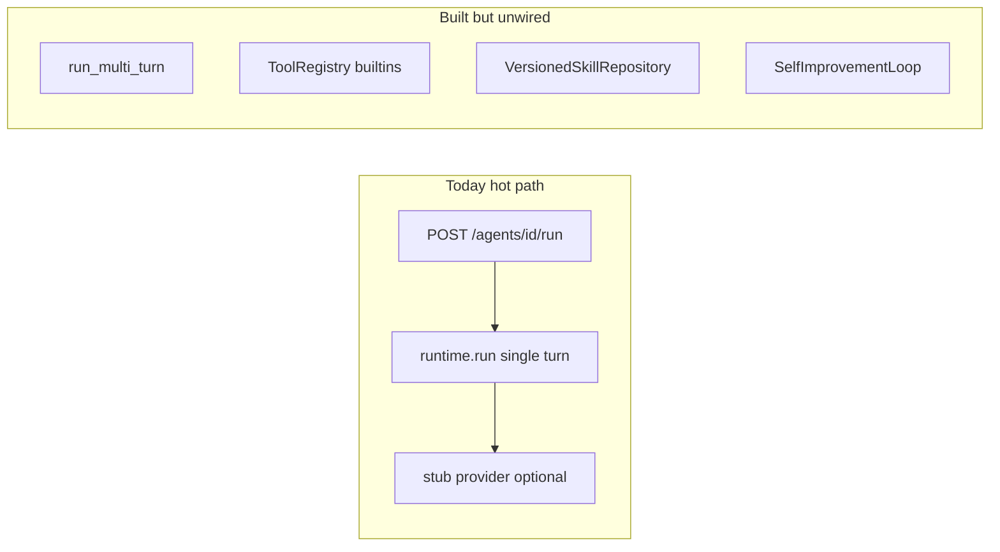
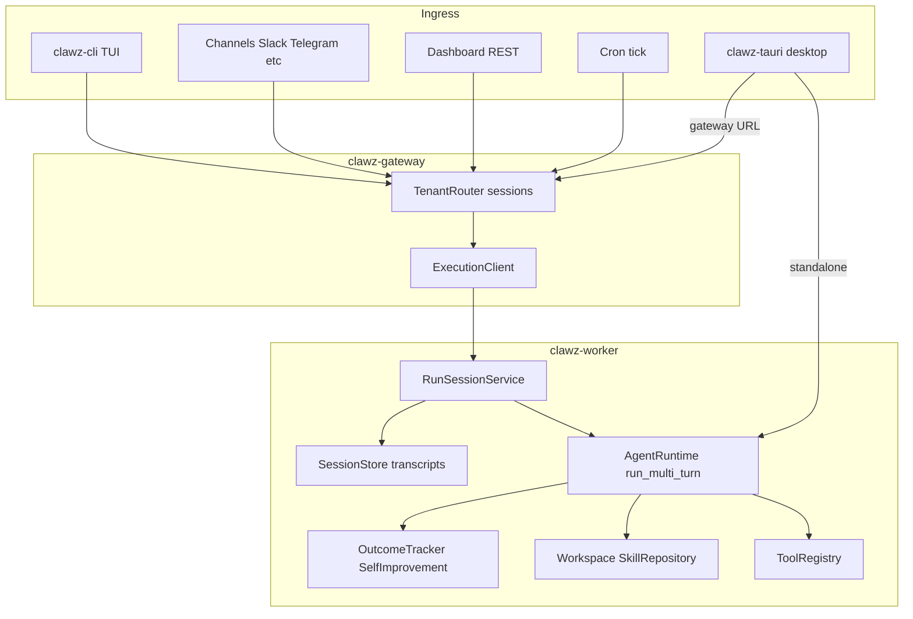
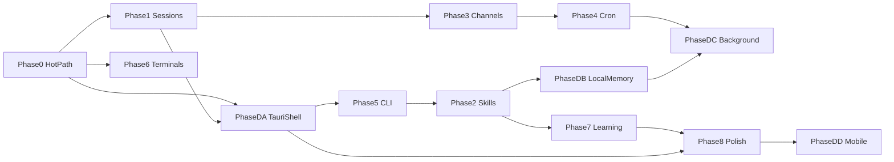

# ClawZ Best-of-Breed Agent Runtime Plan

**Document version:** 1.1  
**Date:** 2026-05-29  
**Status:** Proposed  
**References:** [OpenClaw](https://github.com/openclaw/openclaw), [Hermes Agent](https://github.com/NousResearch/hermes-agent), [OpenHuman](https://github.com/tinyhumansai/openhuman) — desktop/Tauri appendix: [openhuman-comparison.md](openhuman-comparison.md)

**Decisions (confirmed):**

- **Personas:** Both — personal assistant defaults in `CLAWZ_MODE=standalone`, enterprise defaults in `micro`/`elastic` with PRISM-G and approvals.
- **CLI home:** New **`clawz-cli`** crate (`clawz onboard`, `clawz agent`, etc.).
- **Desktop UI:** Embed `web/` in Tauri; dual mode — **standalone** (embedded worker) vs **gateway URL** (REST/WS to `clawz-gateway`).

---

## Goal

Evolve ClawZ from a **single-turn chat API** into an **always-on, tool-using, session-persistent assistant** comparable to **OpenClaw**, **Hermes**, and **OpenHuman** (desktop/Tauri UX, local memory, native shell), while preserving ClawZ’s **enterprise differentiators** (PRISM-G governance, audit chain, multi-tenant gateway, fleet/mesh).

---

## Current state (why it feels like a chatbot)



| Gap | Evidence |
|-----|----------|
| Single LLM call per message | `crates/clawz-worker/src/service.rs` — `run_turn` calls `runtime.run()`, not `run_multi_turn()` |
| Tools not in pipeline | `agent.rs` — `ExecuteToolsStep::new()` with empty map; `provider.rs` reads `tool_schemas` meta never set |
| Runtime deps minimal | `service.rs` — `RuntimeDependencies::new()` only router/memory/governance/cost |
| Channels = one-shot | `telephony.rs` — webhook → `run_turn` with `conversation_id: None` |
| Autonomous = fake loop | `agents.rs` — spawns N× `run_turn` with canned prompts |
| TUI unwired | `tui/mod.rs` never called from `clawz-gateway` binary |
| No cron | No worker cron module (OpenClaw: `src/cron/`, Hermes: `cron/scheduler.py`) |

---

## Target architecture



**Design principle:** one internal primitive — `RunSession::execute(session_key, user_message, opts)` — used by REST, channels, cron, CLI, and gateway-mode desktop. Gateway stays thin; worker owns the loop. Tauri **standalone** may call `run_multi_turn` in-process until gateway parity (P0) is complete.

---

## Desktop shell — OpenHuman reference

Full feature matrix and file touchpoints: **[openhuman-comparison.md](openhuman-comparison.md)** (appendix).

### Why OpenHuman

[OpenHuman](https://github.com/tinyhumansai/openhuman) is the closest reference for **consumer-first personal AI harness** (large Rust core, React + Vite UI, Tauri 2 desktop, experimental mobile). ClawZ [`clawz-tauri`](../crates/clawz-tauri/) is an early shell (~14 source files, static HTML, three IPC commands) that embeds `clawz-worker` in-process and **replaces the HTTP gateway for local desktop**.

**Strategic takeaway:** Do not fork OpenHuman. **Cherry-pick patterns** into existing crates, reuse [`web/`](../web/) as the rich UI, and use Tauri as a **native host** (tray, keychain, notifications, optional gateway client) — not a second minimal HTML app.

ClawZ **enterprise strength** (gateway, PRISM-G, fleet, React dashboard) is ahead of OpenHuman on ops and governance. OpenHuman is **far ahead** on personal-assistant UX, local memory, integrations surface, background cognition, voice/mascot, packaging, and mobile scaffolding.

### Architecture (today vs target)

```mermaid
flowchart TB
  subgraph openhuman [OpenHuman desktop]
    OH_UI["React + Redux + Socket.io"]
    OH_Tauri["Tauri shell CEF scanners tray"]
    OH_Core["openhuman_core in-process JSON-RPC"]
    OH_UI -->|IPC + HTTP /rpc| OH_Tauri
    OH_Tauri --> OH_Core
    OH_Core --> SQLite["SQLite memory tree vault"]
    OH_Core --> Composio["Composio + auto-fetch"]
    OH_Core --> Managed["Managed backend optional"]
  end

  subgraph clawz_today [ClawZ today]
    CZ_UI["Static HTML src-ui"]
    CZ_Tauri["clawz-tauri"]
    CZ_Worker["clawz-worker embedded"]
    CZ_GW["clawz-gateway optional"]
    CZ_Web["web/ React dashboard"]
    CZ_UI --> CZ_Tauri
    CZ_Tauri --> CZ_Worker
    CZ_Web --> CZ_GW
    CZ_GW --> CZ_Worker
  end

  subgraph clawz_target [ClawZ target shell]
    Web2["web/ or shared UI package"]
    Tauri2["clawz-tauri host"]
    Mode{"CLAWZ_SHELL_MODE"}
    Web2 --> Tauri2
    Tauri2 --> Mode
    Mode -->|standalone| Embed["embedded worker"]
    Mode -->|enterprise| GW2["gateway REST/WS"]
  end
```



### Comparison dimensions

| Dimension | OpenHuman | ClawZ `clawz-tauri` | ClawZ `web/` dashboard |
|-----------|-----------|----------------------|-------------------------|
| UI stack | React + Vite + Vitest + E2E | Single `src-ui/index.html` | Full React app, fleet/monitoring/config |
| Core coupling | Rust core + JSON-RPC | Direct `AgentRuntime` in Tauri | HTTP to gateway |
| Agent loop | Full harness + tools + threads | **`run_multi_turn`** in `commands.rs` (ahead of gateway default) | Single-turn via gateway (P0 gap) |
| Local DB | SQLite (memory tree, vault, threads) | `rusqlite` dep, unused in commands | Postgres via gateway |
| Mobile | `src-tauri-mobile` + iOS/Android scripts | `mobile_entry_point` only | N/A (browser) |
| Packaging | Homebrew / apt / signed MSI, auto-update | Basic `tauri.conf.json` bundle | Docker / VPS |
| Backend dependency | Default managed sign-in | Env API keys only | Self-hosted |

### ClawZ wins (keep, don’t copy)

- **Enterprise gateway:** multi-tenant API keys, admission control, mesh/fleet.
- **PRISM-G governance and audit chain** — deeper compliance than OpenHuman `security/` sandbox.
- **Deployment story:** Docker micro mode, prebuilt GHCR images, [`scripts/deploy.sh`](../scripts/deploy.sh).
- **Dashboard depth:** agents, fleet, monitoring, config APIs — fleet ops, not just product UX.

### Adopt selectively (OpenHuman patterns)

| Capability | ClawZ gap | Priority |
|------------|-----------|----------|
| UI-first onboarding + doctor | TUI unwired; no desktop doctor | **P0** / P5 (`clawz onboard`, `clawz doctor`) |
| OS keyring secrets | API keys via env only | **P0** — Phase DA |
| React product UI in Tauri | Dashboard not embedded | **P0** — Phase DA |
| Memory tree + local SQLite | pgvector only; no desktop tree | **P1** — Phase DB |
| TokenJuice-style compression | No pre-LLM shrink | **P1** — Phase DB / provider pre-step |
| Integration auto-fetch (~20 min) | No background ingest | **P1** — Phase DC |
| Subconscious / background ticks | Autonomous API is fake loop | **P1** — Phase DC + P3/P4 |
| Cron + skills UI | Unwired repos | **P1** — P2, P4, P8 |
| Auto-update, signed installers | `cargo tauri build` only | **P1** release engineering |
| MCP client, voice, screen intel | Partial / none | **P2** personal optional |
| Mobile project | Design mockups only | **P2** — Phase DD |
| Webview scanners, mascot, Meet agent | None | **P3** — defer |

### Explicitly defer

- **Managed OpenHuman backend** as default — conflicts with self-hosted enterprise.
- **CEF + per-app webview scanners** — prefer official channel APIs (Slack, Twilio, etc.).
- **Crypto wallet / Polymarket** — out of scope.
- **Mascot + Google Meet agent** — optional novelty only.

### Surprising ClawZ advantage (preserve)

**Tauri already calls `run_multi_turn`** in [`agent_chat`](../crates/clawz-tauri/src/commands.rs) while gateway [`run_turn`](../crates/clawz-worker/src/service.rs) is single-turn. Fixing runtime **P0** benefits gateway and web more than Tauri chat.

Desktop implementation phases **DA–DD** are defined below; detailed matrix: **[openhuman-comparison.md](openhuman-comparison.md)**.

---

## Mode matrix (personal vs enterprise)

| Behavior | `CLAWZ_MODE=standalone` (personal) | `micro` / `elastic` (enterprise) |
|----------|-----------------------------------|----------------------------------|
| Tool approval | Auto-approve low-risk; prompt on shell/file | PRISM-G + approval workflow on risky tools |
| DM / channel access | Pairing code allowlist (Hermes/OpenClaw pattern) | Tenant-scoped channel config + RBAC |
| Skills writes | Agent may propose skills; light review | Governance gate on skill updates |
| Cron | Enabled locally | Per-tenant quotas + audit |
| Sandbox | Optional Docker backend | Required for shell/browser in fleet agents |
| Desktop shell | Embedded worker + local SQLite (Phase DB) | Gateway URL + keyring API key (Phase DA) |

Implement via `DeploymentMode` in `clawz-core` + config in `AppConfig`.

---

## Phase 0 — Agent hot path (foundation, ~2–3 weeks)

**Outcome:** One user message runs a **full tool loop** with streaming events; real providers work out of the box.

### 0.1 `RunSessionService` (worker)

- New module: `crates/clawz-worker/src/runtime/session_run.rs`
- API: `execute(session_id, agent_id, RunTurnRequest) -> RunSessionResult { final_text, messages, events, usage }`
- Implementation: call `AgentRuntime::run_multi_turn` (or extract shared loop from it)
- Replace `WorkerService::run_turn` body to delegate here

### 0.2 Wire tools end-to-end

In `AgentRuntime::build_pipeline()` (`crates/clawz-worker/src/runtime/agent.rs`):

1. Accept `Arc<ToolRegistry>` in `RuntimeDependencies` (add field + builder)
2. Before pipeline: `ctx.insert_meta("tool_schemas", registry.schemas_json())`
3. Build `ExecuteToolsStep` by registering each tool from registry

In `WorkerService::runtime_for` (`crates/clawz-worker/src/service.rs`):

- Pass `self.tools.clone()` into `RuntimeDependencies`
- Set `approval_required` tool names from governance config (enterprise)

### 0.3 Turn event stream

- New type: `TurnEvent` enum (`ProviderDelta`, `ToolStart`, `ToolEnd`, `GovernanceHold`, `TurnComplete`, `Error`)
- `tokio::sync::broadcast` or `mpsc` per `session_id` / `run_id`
- Emit from `SelectProviderStep`, `ExecuteToolsStep`, `ApplyGovernanceStep`
- Gateway WS: replace synthetic sequence in `ws/handlers.rs` with worker event subscription
- Optional: `GET /agents/{id}/runs/{run_id}/events` (SSE)

**Reference:** Hermes `agent/conversation_loop.py` callbacks; OpenClaw `infra/agent-events.ts`.

### 0.4 Provider defaults

- Document `CLAWZ_STUB_PROVIDER=1` as dev-only in INSTALL.md
- `RetrieveContextStep`: load full conversation history from `MemoryBackend` by `conversation_id`

### 0.5 Tests

- Integration: mock provider returns `tool_calls` → executor runs tool → second provider call returns final text
- Regression: `run_turn` completes only after tool loop finishes

**Depends on:** —  
**Key files:** `service.rs`, `agent.rs`, `session_run.rs`, `turn_events.rs`, `ws/handlers.rs`

**Implementation status (2026-05-30):**

| Item | Status |
|------|--------|
| 0.1 `session_run` + `run_multi_turn` hot path | Done |
| 0.2 Tools wired in `RuntimeDependencies` | Done |
| 0.3 `TurnEvent` bus + gateway bridge + WS | Done |
| 0.4 Stub provider documented; transcript in `RetrieveContextStep` | Done |
| 0.5 Tool-loop integration tests | Done |
| SSE `GET /agents/{id}/runs/{run_id}/events` | Done |

---

## Phase 1 — Session-native loop (~2 weeks)

**Outcome:** Durable transcripts, stable `session_key`, chat commands.

### 1.1 Session model

- New types in `clawz-core`: `SessionKey { tenant_id, channel, peer_id, agent_id }`
- `SessionStore` trait: `append_message`, `load_transcript`, `compact`, `reset`
- Backends:
  - Postgres (extend memory/message repos)
  - Filesystem for standalone: `~/.clawz/sessions/{session_key}/transcript.jsonl`

**Reference:** OpenClaw `config/sessions/transcript.ts`; Hermes session DB tests.

### 1.2 Bind sessions to ingress

- Channels: `session_key` from `from` + `channel_id` + `agent_id`; persist `conversation_id`
- REST `run`: accept/return `session_id`
- Rooms: align `conversation_id` with `SessionStore`

### 1.3 Session commands

- `/new`, `/reset`, `/compact`, `/usage` in gateway or worker message preprocessor
- `POST /api/v1/sessions/{id}/compact` for dashboard

**Reference:** Hermes CLI/messaging command table; OpenClaw session concepts.

**Depends on:** P0  
**Key files:** `clawz-core/src/session.rs`, DB migrations, `service.rs`

**Implementation status (2026-05-30):**

| Item | Status |
|------|--------|
| 1.1 `SessionStore` + file transcripts | Done |
| 1.2 `conversation_id` on REST/channels | Done |
| 1.3 `/compact` command + `POST /sessions/{id}/compact` | Done |
| 1.3 `GET /sessions` list API | Done |
| Postgres session backend (`008_sessions.sql`, file fallback) | Done |

---

## Phase 2 — Skills workspace (~2–3 weeks)

**Outcome:** Workspace files shape every run; skills discoverable and versioned.

**Implementation status (2026-05-28):**

| Item | Status |
|------|--------|
| 2.1 Workspace layout + `scripts/init-workspace.sh` | Done |
| 2.2 `WorkspaceLoader` + `RetrieveContextStep` / `RuntimeDependencies` | Done |
| 2.3 `GET /api/v1/skills`, `GET /api/v1/skills/{name}` | Done |
| 2.3 `POST /api/v1/skills`, dashboard Config tab | Done |
| 2.3 `VersionedSkillRepository` in enterprise `LearningStack` | Done |
| 2.4 `SkillCurator::maybe_propose` post-turn hook | Done |

### 2.1 Workspace layout

```text
~/.clawz/workspace/           # standalone
/var/lib/clawz/tenants/{id}/  # enterprise
  AGENTS.md
  SOUL.md
  skills/
    {skill-name}/SKILL.md
  context/
```

### 2.2 Loader (worker)

- New: `crates/clawz-worker/src/workspace/loader.rs`
- Model on OpenClaw `src/agents/skills/workspace.ts`: `load_workspace_skill_entries`, `build_skills_prompt_snapshot`
- Extend `RetrieveContextStep`: merge `AGENTS.md` + active skills into `META_SYSTEM_PROMPT`

### 2.3 Integrate `VersionedSkillRepository`

- Wire in `runtime_for` for enterprise
- API: `POST/GET /api/v1/skills`; dashboard Config tab
- Agent-proposed updates → governance approval → `update_skill`

### 2.4 Skill learning (Hermes-style, gated)

- Post-turn hook: `SkillCurator::maybe_propose(transcript)` (reference Hermes `agent/curator.py`)
- Personal: auto-apply low-risk patches; enterprise: governance proposal only

**Depends on:** P0  
**Key files:** `crates/clawz-worker/src/workspace/`, `agent.rs`, gateway skills routes

---

## Phase 3 — Channels and always-on assistant (~3–4 weeks)

**Outcome:** Inbound messages drive `RunSession`; stack runs continuously.

**Implementation status (2026-05-28):**

| Item | Status |
|------|--------|
| 3.1 `ChannelSupervisor` poll loop + `poll_channel` worker API | Done |
| 3.1 Generic `POST /webhooks/{channel_type}/{channel_id}` | Done |
| 3.1 Shared inbound dispatch (`channel_inbound`) | Done |
| 3.2 `POST/GET /api/v1/channels/pairing` + file allowlist | Done |
| 3.3 Compose `restart: unless-stopped` + systemd unit templates | Done |
| 3.4 Serve `web/dist` from gateway when built | Done |
| 3.4 Dashboard live tool timeline (`/ws/events` + ChatPanel) | Done |

### 3.1 Channel runtime loop

- New: `ChannelSupervisor` (gateway or worker)
  - Generalize webhooks: `/webhooks/{channel_type}/{channel_id}`
  - Polling for channels without webhooks (`channels/native/*.rs`)
  - Message → `RunSession::execute` → `send_channel_message`

**Reference:** Hermes `gateway/`; OpenClaw `src/channels/`.

### 3.2 DM pairing and security

- `POST /api/v1/channels/pairing` + allowlist store
- Enterprise: tenant-scoped allowlists in Postgres

### 3.3 Always-on deployment

- systemd units: `clawz-gateway`, `clawz-worker`, `clawz-channel-supervisor`
- `scripts/install.sh --install-daemon` (mirror `openclaw onboard --install-daemon`)
- Compose: `restart: unless-stopped`, healthchecks (`docker-compose.prod.yml`)

### 3.4 Gateway assistant home

- Optional: serve `web/dist` from gateway (`server.rs`) for single-port UX
- Dashboard: live tool timeline (Phase 0 events)

**Depends on:** P1, P5 (minimal)  
**Key files:** `telephony.rs`, new `channel_supervisor.rs`, `server.rs`

---

## Phase 4 — Cron and proactive automation (~2 weeks)

**Outcome:** Scheduled jobs run agents unattended; results delivered to channels.

### 4.1 Cron subsystem

- New: `crates/clawz-worker/src/cron/`
  - `JobStore` (JSON file standalone / Postgres enterprise)
  - `Scheduler::tick()` every 60s with file lock
  - Job schema: cron expr, prompt, agent_id, delivery channel, enabled_toolsets

**Reference:** OpenClaw `src/cron/`; Hermes `cron/scheduler.py`.

### 4.2 Execution path

- Cron tick → ephemeral `session_key` → `RunSession::execute` → channel delivery
- Disable interactive tools in cron context (Hermes cron disabled toolsets)

### 4.3 API + CLI

- `POST/GET /api/v1/cron/jobs`, `POST /cron/jobs/{id}/run`
- `clawz cron add`, `clawz cron list`

**Depends on:** P1, P3  
**Key files:** `crates/clawz-worker/src/cron/`, gateway cron routes

**Implementation status (2026-05-28):**

| Item | Status |
|------|--------|
| 4.1 `FileJobStore` + 60s scheduler + file lock | Done |
| 4.1 Postgres `PostgresJobStore` + migration `007_cron_jobs.sql` | Done (file fallback until migrated) |
| 4.2 `RunSession` via `cron_mode` + channel delivery | Done |
| 4.2 `disabled_toolsets` → partial tool allowlist | Done |
| 4.3 Gateway `GET/POST/DELETE /api/v1/cron/jobs`, `POST …/run` | Done |
| 4.3 Worker control `/v1/cron/jobs` (micro mode) | Done |
| 4.3 `clawz cron list/add/run/remove` | Done |

---

## Phase 5 — `clawz-cli` + onboarding (~2–3 weeks)

**Outcome:** `clawz onboard` is the recommended operator path.

### 5.1 New crate

- `crates/clawz-cli/` with binary `clawz`
- Dependencies: `clap`, `reqwest`, `tokio`, `clawz-core` config types
- Add to workspace `Cargo.toml`

### 5.2 Commands

| Command | Reference |
|---------|-----------|
| `clawz onboard [--install-daemon]` | OpenClaw `src/commands/onboard.ts` |
| `clawz setup` / `clawz doctor` | Hermes `hermes setup`, `hermes doctor` |
| `clawz gateway start\|stop\|status` | `openclaw gateway` |
| `clawz agent --message "..."` | `openclaw agent` |
| `clawz channels login` | OpenClaw `onboard-channels.ts` |
| `clawz cron …` | Phase 4 |
| `clawz tui` | Wire `tui::run_config` via API or shared lib |

### 5.3 Wire gateway TUI module

- Extract shared `clawz-tui` lib or have CLI call gateway admin HTTP API
- Fix onboarding env names (`CLAWZ_JWT_SECRET`, port `3000`)

### 5.4 Docs

- Extend INSTALL.md first-run; link deployment-build-strategy.md §18

**Depends on:** P0  
**Key files:** `crates/clawz-cli/`, `tui/mod.rs`, INSTALL.md

**Implementation status (2026-05-30):**

| Item | Status |
|------|--------|
| 5.1 `clawz-cli` crate in workspace | Done |
| 5.2 `onboard`, `doctor`, `gateway`, `agent`, `cron` | Done |
| 5.2 `clawz migrate openclaw` | Done |
| 5.3 Gateway TUI wired | Deferred |
| 5.4 INSTALL.md first-run | Done |

---

## Phase 6 — Terminal backends (~2–3 weeks)

**Outcome:** Shell/file tools run in local, Docker, or SSH sandboxes.

### 6.1 Trait

- `crates/clawz-worker/src/terminal/mod.rs`: `TerminalBackend` (`exec`, `read_file`, `write_file`, `cwd`)
- Implementations: `LocalBackend`, `DockerBackend`, `SshBackend`

### 6.2 Config

- `CLAWZ_TERMINAL_BACKEND=local|docker|ssh` per agent or deployment mode
- Enterprise: default `docker` for non-main sessions (OpenClaw sandbox policy)

### 6.3 Tool routing

- `ShellTool` / `FileOpsTool` delegate to configured backend
- Fleet containers: workspace volume mount

**Reference:** Hermes terminal backends; OpenClaw sandbox modes.

**Depends on:** P0  
**Key files:** `crates/clawz-worker/src/terminal/`, tool routing in `tools/`

**Implementation status (2026-05-28):**

| Item | Status |
|------|--------|
| 6.1 `TerminalBackend` trait + Local/Docker/SSH | Done |
| 6.2 `CLAWZ_TERMINAL_BACKEND` + deployment defaults | Done |
| 6.3 `shell` / `file_ops` delegate to backend | Done |
| Fleet workspace volume in Docker backend | Done (`/workspace` bind mount) |

---

## Phase 7 — Memory and self-improvement (~2 weeks)

**Outcome:** Closed learning loop runs with governance.

### 7.1 Wire existing loops

In `WorkerService::runtime_for`:

- Attach `OutcomeTracker`, `SelfImprovementLoop`, `SkillRepository`, `IdentityStore` to `RuntimeDependencies`
- Enable `self_improvement_interval_turns` in `run_multi_turn`

### 7.2 Memory upgrades

- Cross-session FTS search over transcripts
- User profile per tenant
- Post-turn memory nudge → embeddings (`memory/rag.rs`)

### 7.3 Enterprise governance

- Self-improvement proposals through `ProposalGatekeeper`
- Audit entries for skill/memory mutations

**Depends on:** P2  
**Key files:** `service.rs`, `memory/`, `learning/`

**Implementation status (2026-05-28):**

| Item | Status |
|------|--------|
| 7.1 `LearningStack` wired in `build_runtime_deps` | Done |
| 7.1 `CLAWZ_SELF_IMPROVEMENT_INTERVAL_TURNS` (default 5) | Done |
| 7.2 Cross-session transcript FTS (`transcript_fts.db`) | Done |
| 7.2 Per-tenant profiles (`~/.clawz/profiles/`) | Done |
| 7.2 Post-turn RAG nudge (`CLAWZ_MEMORY_NUDGE`, OpenAI/Ollama) | Done |
| 7.3 `ProposalGatekeeper` + audit on skill/improvement apply | Done |
| File-backed identity (`~/.clawz/identities/`) | Done |

**Env:** `CLAWZ_SELF_IMPROVEMENT=0` disables loop; `CLAWZ_MEMORY_NUDGE=0` skips embed ingest; `CLAWZ_OLLAMA_EMBED=1` + `OLLAMA_HOST` for local embeddings.

---

## Phase 8 — Dashboard and migration polish (~1–2 weeks)

**Outcome:** Operators see full run history; OpenClaw users can migrate.

- Agents UI: tool timeline, session list, compact action
- `clawz migrate openclaw` (config, workspace, skills) — reference Hermes `hermes claw migrate`
- Fix autonomous endpoint: `RunSession` + real WS events

**Depends on:** P0, P1, DA  
**Key files:** `web/` agents views, `ws/handlers.rs`, gateway migrate route

**Implementation status (2026-05-30):**

| Item | Status |
|------|--------|
| `GET /api/v1/sessions` + compact | Done |
| Agents UI sessions bar + compact | Done |
| ChatPanel live tool timeline (`/ws/events`) | Done |
| `clawz migrate openclaw` | Done |
| Autonomous loop + real WS (`turn_event_bridge`) | Done |

---


## Phase DA — Unify Tauri shell (~2 weeks)

**Outcome:** Desktop app is the same React product as the web dashboard; users pick embedded worker or gateway URL without env-file surgery.

### Tasks

1. **Embed [`web/`](../web/) in Tauri** — replace `crates/clawz-tauri/src-ui/index.html`; align `tauri.conf.json` + `web/vite.config.ts` base paths.
2. **Dual connection mode** (`CLAWZ_SHELL_MODE`):
   - `standalone` → embedded `clawz-worker` (current IPC)
   - `gateway` → REST/WS base URL + API key (OpenHuman `CORE_RPC_URL` pattern)
3. **System tray + notifications** — extend `tray.rs` with connection and agent run status.
4. **OS keyring** — provider keys, gateway URL, API key via `tauri-plugin-keyring` or secret service in `commands.rs`.
5. **Settings UI** — shell mode toggle in dashboard settings panel.

**Depends on:** P0 (tool loop parity for gateway mode)  
**Key files:** `crates/clawz-tauri/tauri.conf.json`, `src/commands.rs`, `src/tray.rs`, `web/src/lib/api.ts`, `crates/clawz-tauri/design/design-system.md`

**Implementation status (2026-05-30):**

| Item | Status |
|------|--------|
| Embed `web/` via `frontendDist` | Done |
| Standalone vs gateway shell mode + keyring | Done |
| `DesktopShellSettings` in Config | Done |
| Tray connection / run status | Done |
| Deprecate static `src-ui` (`DEPRECATED.md`, embed `web/`) | Done |

---

## Phase DB — Local memory standalone (~2 weeks)

**Outcome:** Personal mode persists conversation context locally across restarts without Postgres.

**Implementation status (2026-05-28):**

| Item | Status |
|------|--------|
| SQLite store (`~/.clawz/memory.db`) + FTS5 `search_text` | Done |
| `create_memory_backend()` wired in worker + Tauri standalone | Done |
| Context compression in `SelectProviderStep` (standalone) | Done |
| `RetrieveContextStep` FTS snippets from local memory | Done |
| Hourly rollups (`memory_rollups.log`, `CLAWZ_MEMORY_ROLLUP`) | Done |
| Full memory tree graph (`memory/tree.rs` + context injection) | Done |

### Tasks

1. **Local SQLite store** — chunks + FTS; optional hourly rollups (defer full Memory Tree graph).
2. **Markdown workspace** — `~/clawz/workspace/` with `AGENTS.md` + `skills/` (align P2); optional Obsidian symlink.
3. **Context compression** — TokenJuice-style pre-LLM shrink in worker: HTML strip, tool output caps, dedupe (preserve CJK).
4. **Wire `RetrieveContextStep`** — standalone reads local store + workspace before provider call.

**Depends on:** P1, P2, DA  
**Key files:** `clawz-worker/src/memory/`, `runtime/steps/provider.rs` (pre-step compression), optional `clawz-desktop-store` crate

---

## Phase DC — Background ingest (~2 weeks)

**Outcome:** Connectors and subconscious-style ticks run without user messages; cron UI visible in shell.

### Tasks

1. **Periodic sync (~20 min)** — gateway connector scheduler → memory store (OpenHuman auto-fetch analogue).
2. **Subconscious tick** — background `run_multi_turn` on new memory chunks; governance + opt-in flag.
3. **Cron UI in dashboard + tray** — list jobs, last run, manual trigger (ties to P4).
4. **Disable risky tools** in background context (mirror Hermes cron toolsets).

**Depends on:** P3, P4, DB  
**Key files:** `crates/clawz-worker/src/cron/`, gateway connector scheduler, `web/` cron views

**Implementation status (2026-05-28):**

| Item | Status |
|------|--------|
| 1. Connector sync scheduler (~20 min) → memory ingest | Done |
| 2. Subconscious tick (`CLAWZ_SUBCONSCIOUS=1`, tools off) | Done |
| 3. Cron UI dashboard + tray menu | Done |
| 4. Risky tools disabled in background/cron | Done (`cron_mode` / `background_mode`) |

---

## Phase DD — Mobile scaffold (~1–2 weeks)

**Outcome:** iOS/Android build pipelines exist; phone layout documented; not feature-complete.

### Tasks

1. **New `crates/clawz-tauri-mobile/`** — mirror OpenHuman `src-tauri-mobile` split (separate `tauri.conf`, entitlements).
2. **Shared UI package** — consume same `web/` build with responsive layout breakpoints.
3. **CI scripts** — `tauri ios/android` build stubs in `scripts/`; document in INSTALL.md.
4. **Defer** voice PTT, CEF, webview scanners until desktop DA–DC stable.

**Depends on:** DA, P8  
**Key files:** `crates/clawz-tauri-mobile/`, `web/` responsive layout, INSTALL.md mobile section

**Implementation status (2026-05-30):**

| Item | Status |
|------|--------|
| `crates/clawz-tauri-mobile/` scaffold | Done |
| `scripts/build-mobile.sh` CI stub | Done |
| INSTALL.md mobile section | Done |
| Shared responsive `web/` + `MobileNav` bottom bar | Done |
| iOS/Android feature-complete (voice, CEF, etc.) | Deferred |

---

## Implementation order



**Recommended sequence:**

**P0 → P1 → DA → P5 → P2 → DB → P3 → P4 → DC → P6 → P7 → P8 → DD**

Rationale: hot path and sessions first; unify desktop shell and onboarding before local memory and channels; background ingest after cron exists; mobile last.

---

## Key files to create or modify

| Area | Files |
|------|--------|
| Hot path | `service.rs`, `agent.rs`, `session_run.rs`, `turn_events.rs` |
| Events | `ws/handlers.rs` |
| Sessions | `clawz-core/src/session.rs`, DB migrations |
| Workspace | `crates/clawz-worker/src/workspace/` |
| Context compression | `runtime/steps/provider.rs` (pre-step), optional `tokenjuice/` module |
| Cron | `crates/clawz-worker/src/cron/` |
| CLI | `crates/clawz-cli/` |
| Channels | `telephony.rs`, `channel_supervisor.rs` |
| Tauri shell | `crates/clawz-tauri/` (`tauri.conf.json`, `commands.rs`, `tray.rs`), `web/vite.config.ts`, `web/src/lib/api.ts` |
| Local memory | `clawz-worker/src/memory/`, optional `clawz-desktop-store` |
| Mobile | `crates/clawz-tauri-mobile/` |
| Docs | INSTALL.md, deployment-build-strategy.md, openhuman-comparison.md (appendix) |

---

## Success criteria

1. `clawz agent -m "What's on disk?"` runs **multiple tool iterations** (not `stub:` echo).
2. Telegram/Slack webhook reply uses the **same session** until `/new`.
3. `clawz cron add "0 9 * * *" "daily summary"` delivers without manual API calls.
4. `clawz onboard --install-daemon` produces a running stack in under 5 minutes (prebuilt images).
5. Enterprise: shell tool requires approval; audit chain records tool calls.
6. Dashboard shows **live tool steps** for an agent run.
7. Tauri app loads the **same React UI** as the web dashboard (or a documented subset).
8. User can switch **standalone (embedded)** vs **gateway URL** without editing env files manually.
9. Secrets live in **OS keyring**, not plain-text in workspace.
10. Standalone mode **persists conversation chunks locally** across restarts; gateway-mode desktop runs a **tool-using loop** via `RunSession` (not single-turn stub).

---

## Risks and mitigations

| Risk | Mitigation |
|------|------------|
| Large scope | Phase gates; ship P0+P1+DA before channels/cron/mobile |
| Parallel loops | Single `RunSession` primitive |
| Two UIs | Phase DA embeds `web/`; deprecate static `src-ui` |
| Security | Terminal backends + governance before open DM policies; keyring in DA |
| Breaking API | Keep `POST /agents/{id}/run` shape; add `session_id`, `run_id`, optional events URL |

---

## Related documents

- [openhuman-comparison.md](openhuman-comparison.md) — **appendix:** OpenHuman vs `clawz-tauri` feature matrix, architecture notes, file touchpoints
- [deployment-build-strategy.md](deployment-build-strategy.md) — VPS deploy, onboarding, TUI notes (§18)
- [INSTALL.md](../INSTALL.md) — installation guide
- [ARCHITECTURE.md](ARCHITECTURE.md) — system design
- [AGENTS.md](../AGENTS.md) — development reference

---

**Maintainers:** Enterpryz Ventures
