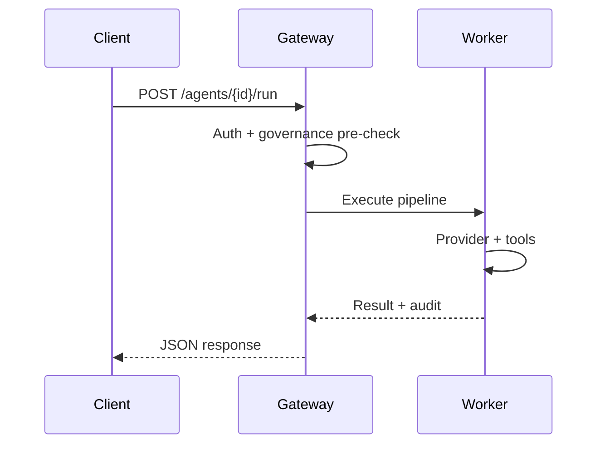

# ClawZ API Reference

**Version:** 1.0 (aligned with gateway `/api/v1`)  
**Audience:** Integration developers and automation engineers  
**Companion documents:** [User Manual](user-manual.md) · [Administration Manual](administration-manual.md) · [INSTALL.md](../INSTALL.md)

Interactive OpenAPI documentation is served at **`/api/docs`**, which redirects to **`/api/v1/system/openapi`**. Use this document for narrative context, authentication patterns, and copy-paste examples in curl, Python, and JavaScript.

---

## 1. Overview

The ClawZ gateway exposes a REST API under `/api/v1`, WebSocket streams under `/ws`, inbound webhooks under `/webhooks`, and an MCP HTTP endpoint at `POST /api/v1/mcp`. All business routes assume TLS in production and require authentication unless listed as public. The worker is not called directly by most integrations; the gateway forwards execution to the worker using internal credentials (`CLAWZ_WORKER_TOKEN`).

```mermaid
flowchart LR
  Client[Your application] -->|HTTPS + API key or JWT| GW[Gateway /api/v1]
  GW -->|Internal| WK[Worker]
  WK --> DB[(Postgres)]
  Client -->|WebSocket| WS[/ws/events]
```

Base URL defaults to `http://localhost:3000` in development. Set `CLAWZ_PUBLIC_URL` when generating absolute links from the gateway (OAuth callbacks, webhook URLs).

---

## 2. Authentication

Production deployments must not rely on `CLAWZ_DISABLE_AUTH=1`. The gateway accepts credentials in this order: `Authorization: Bearer <JWT>`, header `X-API-Key: <key>`, or query `?api_key=<key>`.

API keys are loaded from the `VALID_API_KEYS` environment variable as comma-separated entries. Each key uses the format `hash:user_id:role:tenant_id` (see administration manual for RBAC). JWTs are obtained from `POST /api/v1/system/auth/login` after registration.

Public paths (no auth) include `/health`, `/api/v1/system/health`, auth registration/login/status, OpenAPI, Twilio/Google Voice webhooks, and the entire `/api/v1/setup` tree during onboarding. Setup **mutations** still require `X-Clawz-Setup-Token` as described in the Setup section.

### curl — health check (no auth)

```bash
curl -sS http://localhost:3000/health
curl -sS http://localhost:3000/api/v1/system/health
```

### curl — API key on protected route

```bash
export CLAWZ_API_KEY="your-key-from-VALID_API_KEYS"
curl -sS -H "X-API-Key: ${CLAWZ_API_KEY}" \
  http://localhost:3000/api/v1/agents
```

### Python — session with API key

```python
import os
import requests

BASE = os.environ.get("CLAWZ_URL", "http://localhost:3000")
KEY = os.environ["CLAWZ_API_KEY"]

session = requests.Session()
session.headers["X-API-Key"] = KEY

agents = session.get(f"{BASE}/api/v1/agents").json()
print(agents)
```

### JavaScript — fetch with Bearer JWT

```javascript
const base = process.env.CLAWZ_URL ?? "http://localhost:3000";
const token = process.env.CLAWZ_JWT;

const res = await fetch(`${base}/api/v1/agents`, {
  headers: { Authorization: `Bearer ${token}` },
});
const agents = await res.json();
```

### Error responses

| HTTP status | Meaning |
|-------------|---------|
| 401 | No credential presented |
| 403 | Invalid, expired, or revoked credential |
| 404 | Resource not found |
| 409 | Conflict (e.g. setup already complete) |
| 429 | Admission / quota exceeded |
| 500 | Internal server error |

Error bodies are JSON with a `error` or message field depending on the handler. Prefer checking status codes in clients and logging response bodies for support.

---

## 3. Agents

Agents are the primary automation unit. Create an agent with name, model, and system prompt; run turns with a user message; stop long-running work; or start autonomous sessions for multi-turn loops.

| Method | Path | Description |
|--------|------|-------------|
| GET | `/api/v1/agents` | List agents (`?status=idle`) |
| POST | `/api/v1/agents` | Create agent |
| GET | `/api/v1/agents/{id}` | Get agent |
| PUT | `/api/v1/agents/{id}` | Update agent |
| DELETE | `/api/v1/agents/{id}` | Delete agent |
| POST | `/api/v1/agents/{id}/run` | Single-turn run |
| POST | `/api/v1/agents/{id}/stop` | Stop agent |
| POST | `/api/v1/agents/{id}/autonomous` | Start autonomous session |
| GET | `/api/v1/agents/{id}/history` | Run history |
| GET | `/api/v1/agents/{id}/runs/{run_id}/events` | SSE stream for one run |

### Create agent — curl

```bash
curl -sS -X POST http://localhost:3000/api/v1/agents \
  -H "Content-Type: application/json" \
  -H "X-API-Key: ${CLAWZ_API_KEY}" \
  -d '{
    "name": "support-bot",
    "model": "claude-3-5-sonnet",
    "description": "Tier-1 support",
    "system_prompt": "You are a helpful support agent. Escalate billing issues."
  }'
```

### Run agent — Python

```python
agent_id = "550e8400-e29b-41d4-a716-446655440000"  # from create response
r = session.post(
    f"{BASE}/api/v1/agents/{agent_id}/run",
    json={"message": "Summarize open tickets for tenant acme."},
)
r.raise_for_status()
print(r.json())
```

### Run agent — JavaScript

```javascript
const agentId = "550e8400-e29b-41d4-a716-446655440000";
const run = await fetch(`${base}/api/v1/agents/${agentId}/run`, {
  method: "POST",
  headers: {
    "Content-Type": "application/json",
    Authorization: `Bearer ${token}`,
  },
  body: JSON.stringify({ message: "Hello from CI" }),
});
console.log(await run.json());
```

Advanced routes include `POST /api/v1/agents/orchestrate`, `POST /api/v1/agents/fanout`, and agent-to-agent `POST /api/v1/agents/a2a/discover` and `a2a/invoke` for multi-agent workflows.

---

## 4. Providers

Register LLM backends before pointing agents at production models. API keys are stored but masked on read endpoints.

| Method | Path | Description |
|--------|------|-------------|
| GET | `/api/v1/providers` | List providers (keys hidden) |
| POST | `/api/v1/providers` | Register provider |
| GET | `/api/v1/providers/{id}` | Get provider |
| PUT | `/api/v1/providers/{id}` | Update provider |
| DELETE | `/api/v1/providers/{id}` | Delete provider |
| POST | `/api/v1/providers/{id}/test` | Test connectivity |

### Register OpenAI-compatible provider — curl

```bash
curl -sS -X POST http://localhost:3000/api/v1/providers \
  -H "Content-Type: application/json" \
  -H "X-API-Key: ${CLAWZ_API_KEY}" \
  -d '{
    "name": "openai-prod",
    "provider_type": "openai",
    "api_key": "sk-...",
    "base_url": "https://api.openai.com/v1",
    "enabled": true
  }'
```

Development stacks may set `CLAWZ_STUB_PROVIDER=1` and use model id `stub` without a real provider.

---

## 5. Conversations and rooms

One-to-one conversations live under `/api/v1/conversations`. Multi-participant **rooms** (agents and humans) use `/api/v1/rooms` with sequenced messages and orchestration bindings. Channel adapters can post into rooms when configured in the dashboard or via channel APIs.

| Method | Path | Description |
|--------|------|-------------|
| GET | `/api/v1/conversations` | List conversations |
| GET | `/api/v1/rooms` | List rooms |
| POST | `/api/v1/rooms` | Create room |

Refer to OpenAPI for message append and participant management payloads, which mirror dashboard operations.

---

## 6. Channels and webhooks

Channels register inbound integrations (Slack, Discord, webhooks, etc.). Inbound HTTP from external systems hits **`POST /webhooks/{channel_type}/{channel_id}`** without API key auth; validate signatures per channel adapter documentation.

| Method | Path | Description |
|--------|------|-------------|
| GET | `/api/v1/channels` | List channels |
| POST | `/api/v1/channels` | Create channel |

Configure your SaaS provider to deliver events to `https://your-host/webhooks/<type>/<id>` over HTTPS.

---

## 7. Tools

Tools are registered capabilities executed by the worker during the pipeline Tools step.

| Method | Path | Description |
|--------|------|-------------|
| GET | `/api/v1/tools` | List tools |
| POST | `/api/v1/tools` | Register tool |
| POST | `/api/v1/tools/{id}/execute` | Execute tool directly |
| GET | `/api/v1/tools/marketplace` | Marketplace catalog |

Direct execution bypasses some agent context; prefer agent runs for governed tool use.

---

## 8. Governance

Governance endpoints manage policies, query audit logs, read trust scores, and evaluate actions against PRISM-G rules.

| Method | Path | Description |
|--------|------|-------------|
| GET | `/api/v1/governance/policies` | List policies |
| POST | `/api/v1/governance/policies` | Create policy |
| GET | `/api/v1/governance/audit` | Paginated audit log |
| GET | `/api/v1/governance/trust/{agent_id}` | Trust score |
| POST | `/api/v1/governance/evaluate` | Evaluate action |
| GET | `/api/v1/governance/proposals` | Approval proposals |

### Evaluate action — Python

```python
payload = {
    "agent_id": agent_id,
    "action": "execute_tool",
    "resource": "shell",
    "details": {"command": "rm -rf /"},
}
ev = session.post(f"{BASE}/api/v1/governance/evaluate", json=payload)
print(ev.json())  # expect deny or require_approval in strict policies
```

### Audit query — curl

```bash
curl -sS "http://localhost:3000/api/v1/governance/audit?page=1&limit=50" \
  -H "X-API-Key: ${CLAWZ_API_KEY}"
```

---

## 9. Fleet and cloud deploy

Fleet routes manage worker nodes and agent container deployments (micro/elastic). Cloud deploy routes target external platforms (Fly.io, Railway, Kubernetes, etc.).

| Method | Path | Description |
|--------|------|-------------|
| GET | `/api/v1/fleet` | Fleet nodes |
| GET | `/api/v1/fleet/deployments` | Deployments |
| POST | `/api/v1/fleet/deploy` | Deploy agent to node |
| GET | `/api/v1/cloud/*` | Cloud adapter operations |

Requires Docker socket access on workers for container fleet mode.

---

## 10. System, dashboard, and metrics

| Method | Path | Description |
|--------|------|-------------|
| GET | `/api/v1/system/health` | Health JSON |
| GET | `/api/v1/system/metrics` | Prometheus text |
| GET | `/api/v1/system/config` | System settings |
| PUT | `/api/v1/system/config` | Update settings |
| GET | `/api/v1/system/prism` | PRISM-G status |
| POST | `/api/v1/system/auth/login` | JWT login |
| POST | `/api/v1/system/auth/register` | Register user |
| GET | `/api/v1/dashboard/overview` | Dashboard payload |
| GET | `/api/v1/dashboard/metrics` | Dashboard KPIs |

Scrape **`/api/v1/system/metrics`** or gateway **`/metrics`** (if mounted) from Prometheus. The root **`/health`** endpoint is suitable for load balancer probes.

---

## 11. Setup API (onboarding)

The setup API drives the web wizard and host bootstrap. It is public for reads but mutating calls require **`X-Clawz-Setup-Token`**, returned once from `GET /api/v1/setup/status` when setup is incomplete.

| Method | Path | Description |
|--------|------|-------------|
| GET | `/api/v1/setup/status` | Setup state + bootstrap token |
| POST | `/api/v1/setup/session` | Start or resume session |
| POST | `/api/v1/setup/answer` | Wizard answers |
| POST | `/api/v1/setup/apply` | Apply configuration |
| POST | `/api/v1/setup/complete` | Finish onboarding |
| GET | `/api/v1/setup/stack/status` | Docker/compose probe |
| POST | `/api/v1/setup/stack` | deps / up / down / migrate |

### Stack bootstrap — curl

```bash
TOKEN="$(curl -sS http://localhost:3000/api/v1/setup/status | jq -r .bootstrap_token)"

curl -sS -X POST http://localhost:3000/api/v1/setup/stack \
  -H "Content-Type: application/json" \
  -H "X-Clawz-Setup-Token: ${TOKEN}" \
  -d '{
    "action": "up",
    "install_strategy": "prebuilt",
    "with_web": true,
    "confirm": "yes-install"
  }'
```

When the gateway runs inside Docker without host exec, use the install script command from `stack/status` instead of `POST /setup/stack`.

---

## 12. WebSockets

Connect to **`/ws/events`** for platform events, **`/ws/approvals`** for governance approvals, **`/ws/logs`** for log streaming, and agent-specific streams such as **`/ws/agents/{id}/stream`**. Pass the same API key or JWT according to your gateway WebSocket auth configuration (see gateway `ws` module).

### JavaScript — EventSource-style SSE for run events

For a single run, use SSE on the REST path:

```javascript
const url = `${base}/api/v1/agents/${agentId}/runs/${runId}/events`;
const es = new EventSource(url); // may require auth proxy in production
es.onmessage = (e) => console.log(e.data);
```

Production deployments often terminate TLS at a proxy that forwards `Authorization` headers; verify your ingress supports SSE.

---

## 13. MCP

`POST /api/v1/mcp` accepts Model Context Protocol JSON-RPC payloads so external clients (Claude Desktop, IDE plugins) can list tools and resources exposed by ClawZ. Authenticate like other `/api/v1` routes unless your deployment documents a separate MCP key.

---

## 14. Cron and background jobs

| Method | Path | Description |
|--------|------|-------------|
| GET | `/api/v1/cron/jobs` | List scheduled jobs |
| POST | `/api/v1/cron/jobs` | Create job |
| POST | `/api/v1/cron/jobs/{id}/run` | Run now |
| DELETE | `/api/v1/cron/jobs/{id}` | Delete job |
| POST | `/api/v1/background/subconscious` | Background processing hook |

Scheduled jobs run in the gateway/worker context of the creating tenant; review cron definitions for privilege scope.

---

## 15. Skills and sessions

| Method | Path | Description |
|--------|------|-------------|
| GET | `/api/v1/skills` | List skills |
| POST | `/api/v1/skills` | Create skill |
| GET | `/api/v1/skills/{name}` | Get skill |
| GET | `/api/v1/sessions` | List sessions |
| POST | `/api/v1/sessions/{id}/compact` | Compact session context |

Skills correspond to workspace skill files used by agents; sessions track operator CLI or dashboard session metadata.

---

## 16. Rate limits and best practices

Admission control and provider rate limits protect shared infrastructure. Clients should implement exponential backoff on **429** and **503** responses, respect `Retry-After` when present, and use idempotent keys for create operations where your workflow allows duplicate detection by name.

Store API keys in secret managers, not repositories. Rotate keys by updating `VALID_API_KEYS` and revoking old entries. Use separate keys per environment and tenant. For long-running autonomous agents, prefer WebSocket or SSE consumption over polling `history` in tight loops.



---

## 17. Versioning and compatibility

The `/api/v1` prefix is the stable surface for integrations. Legacy agent routes (`/start`, `/onboard` on agents router) remain for older SDKs. Consult GitHub release notes before upgrading gateway and worker together; database migrations run via `scripts/migrate-db.sh` or `POST /api/v1/setup/stack` with `action: migrate`.

---

*For operational procedures, security hardening, and tenant configuration, see [administration-manual.md](administration-manual.md). For conceptual product usage, see [user-manual.md](user-manual.md).*
