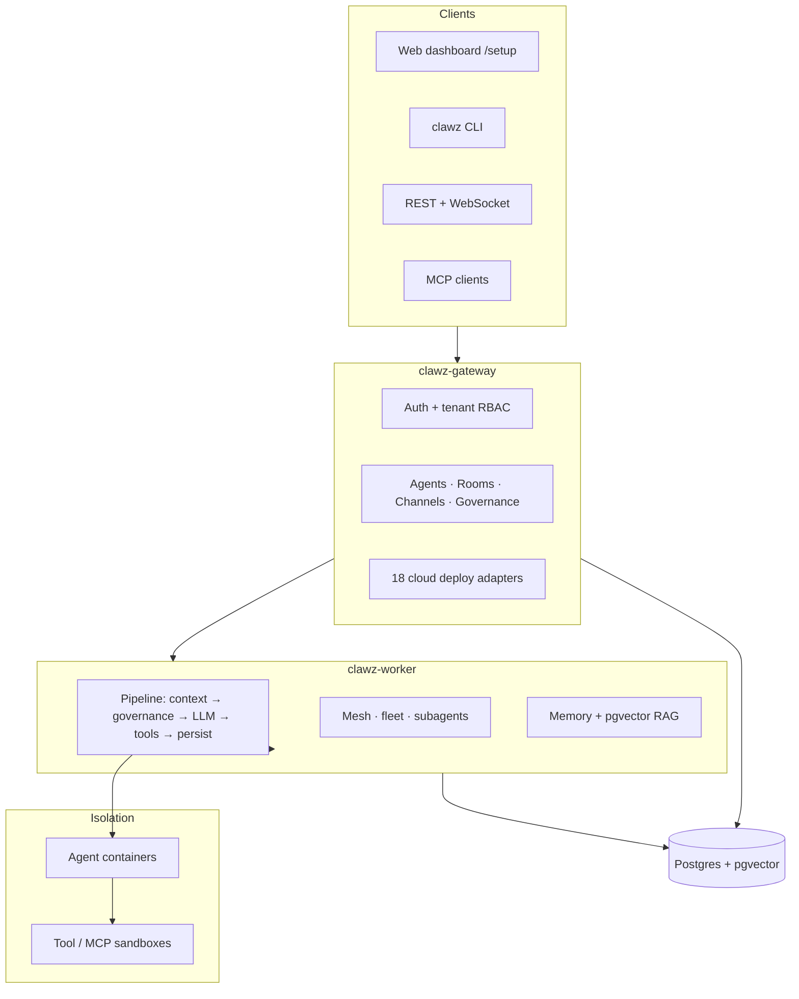

# ClawZ — Product Brochure & Positioning

**Document:** Marketing / sales enablement (Version 1.0)  
**Product:** ClawZ Agent Orchestration Platform  
**Publisher:** Enterpryz Ventures  
**License:** Elastic License 2.0 (ELv2) · Reference implementation of **PRISM-G**

---

## One-line position

**ClawZ is the production runtime for governed AI agent fleets** — not another chat wrapper, but a Rust-native orchestration platform where every agent action passes through compliance guardrails, tamper-evident audit, and container isolation before it touches your systems or data.

---

## Unique selling proposition (USP)

| What buyers get | Why it matters |
|-----------------|----------------|
| **Governance in the execution path** | PRISM-G guardrails run on every pipeline step (not as a post-hoc filter). Policies, trust tiers, and approvals gate tools, messages, and data access before side effects occur. |
| **3-tier container cascade** | Gateway → worker → per-tenant agent containers → tool/MCP sandboxes. Blast radius stays bounded; scaling is horizontal, not “one fat Python process.” |
| **Tamper-evident audit by design** | SHA-256 hash-chained audit log supports SOC 2, GDPR, and EU AI Act evidence requests without bolting on a separate logging product. |
| **One stack, three deployment modes** | Same codebase runs **standalone** (edge/dev), **micro** (Docker Compose / K8s), or **elastic** (mesh + leader election) — operators choose topology, not a different product SKU. |
| **Built in Rust for operators** | Async-first, trait-driven architecture (~65K LOC) with circuit breakers, cost budgets, and Prometheus/OpenTelemetry hooks — aimed at teams who will run this for months, not demo it for an afternoon. |

**USP sentence (brochure-ready):**  
*ClawZ is the only open reference stack that combines multi-agent orchestration, container-native isolation, and PRISM-G governance in a single Rust runtime — so autonomous AI can ship to production with audit trails operators can defend.*

---

## The problem we solve

Most “agent platforms” stop at:

- A single long-lived process with API keys in environment variables  
- Tool calls without enforceable policy or rollback  
- Logs that can be edited after the fact  
- No clear story for multi-tenant isolation, cost caps, or regulatory review  

**ClawZ addresses the gap between a prototype agent script and an operations-ready fleet:** scheduling, memory/RAG, channels (Slack, webhooks, telephony), team coordination, and governance in one platform.

---

## Who ClawZ is for

| Audience | Typical use |
|----------|-------------|
| **Platform / DevOps teams** | Run gateway + worker on VPS or K8s; integrate via REST, WebSocket, MCP |
| **AI product builders** | Ship governed agents to customers with tenant RBAC and budget limits |
| **Compliance-heavy industries** | Finance, health, legal, public sector — need audit chain + approval workflows |
| **MSP / systems integrators** | Deploy per-customer stacks; setup wizard + host bootstrap for repeatable installs |
| **Edge & embedded (T0)** | ESP32-class devices via `clawz-embedded` (Embassy) for sensor/actuator agents |

**Not aimed at:** casual chat-only users who only need a browser UI to a single LLM — they can use ClawZ, but the product’s weight is in **operations and governance**.

---

## Architecture at a glance



**Design principle:** the gateway admits and routes; the worker executes and enforces; containers hold untrusted work.

---

## PRISM-G — the framework behind the product

PRISM-G is Enterpryz Ventures’ six-dimension model for **enterprise autonomous AI**. ClawZ is its **reference implementation** (not a generic checklist pasted into docs).

| Dimension | Letter | ClawZ delivers |
|-----------|--------|----------------|
| **Purpose** | P | Goal decomposition, intent-aligned agent definitions |
| **Reality** | R | Environment discovery, factual grounding in pipeline context |
| **Infrastructure** | I | Tool scheduling, Docker/Bollard, resource bounds, hardware tiers T0–T3 |
| **Swarm** | S | Teams, subagents, fan-out/fan-in, rooms, mesh coordination |
| **Memory & Metrics** | M | Conversation history, embeddings, Prometheus, cost tracking |
| **Governance** | G | Guardrails, trust scoring, council approval, hash-chain audit |

**Marketing angle:** competitors sell “agents.” ClawZ sells **agents that remain accountable** across all six dimensions.

---

## Feature highlights (differentiators)

### 1. Pipeline execution with rollback

Agents run through ordered, **reversible** steps: context → governance → provider → tools → persist. A failed step triggers rollback of prior side effects — consistency without custom orchestration code.

### 2. PRISM-G governance runtime

- Policy evaluation on every action (approve / reject / require approval)  
- **Five-tier trust scoring** (Untrusted → Full) affecting autonomy and approvals  
- **Council** workflows with quorum  
- Compliance export paths (SOC 2, GDPR, EU AI Act oriented)

### 3. Multi-agent collaboration

- **Agent rooms** — 1-many and hybrid topologies, sequenced messages, side-threads  
- **Team coordinator** — load balancing, budget sub-leasing, consensus  
- **Subagents & fan-out** — parallel work with aggregated results  

### 4. Memory and knowledge

- Postgres + **pgvector** for embeddings  
- RAG pipelines with similarity search  
- Conversation threading and retention policies (operator-configured)

### 5. Provider and cost control

- Pluggable LLM adapters (OpenAI, Anthropic, local Ollama/Llama.cpp, stubs for dev)  
- **Circuit breakers** on external calls  
- Per-request, daily, and monthly **budget enforcement**  
- Provider routing with retries and failover patterns

### 6. Tools and integrations

| Layer | Examples |
|-------|----------|
| **Built-in tools** | File I/O, HTTP, sandboxed shell, browser (CDP), Docker lifecycle |
| **MCP** | Model Context Protocol server — expose agents and tools to IDEs |
| **Channels** | Slack, Discord, Teams, Telegram, Twilio SMS/voice, webhooks |
| **Connectors** | 30+ SaaS adapters (CRM, issue tracking, commerce, data) |
| **Cloud deploy** | AWS Lambda, Azure Functions, GCP Cloud Run, Cloudflare, Fly.io, Railway, Kubernetes, Vercel, and more |

### 7. Security and multi-tenancy

- API keys with **tenant-scoped RBAC** (`hash:user:role:tenant`); owner-role grants restricted to existing owners  
- JWT sessions for dashboard users  
- **Fail-closed in production** — release builds refuse to boot without real secrets; no insecure dev fallbacks, auth-bypass compiled out  
- **Per-actor rate limiting** (token bucket) with optional **distributed Postgres quota** across the fleet — `429` + `Retry-After`, fully fail-open  
- **Idempotency keys** for safe, duplicate-free retries on create/run operations  
- **Webhook HMAC-SHA256** verification, request body-size caps, locked-down CORS + HSTS/CSP security headers  
- **SSRF guard** on outbound connector/OAuth fetches (DNS-level, blocks private ranges)  
- **Tamper-evident audit** — SHA-256 hash-chained governance log + resource-level audit of sensitive ops  
- Mesh **firewall** rules between nodes  
- Secrets encryption at rest with a salted KDF (`CLAWZ_SECRETS_KEY`); PII redacted in logs  
- Optional auth disable **only** for local dev (`CLAWZ_DISABLE_AUTH=1`, debug builds only)

### 8. Observability

- `/metrics` Prometheus scrape  
- OpenTelemetry W3C trace propagation into containers  
- Structured execution logs and gateway audit events  
- Dashboard JSON APIs for fleet health

### 9. Install and onboarding (operator-ready)

- **One-click install** — `install.sh` / `install.ps1` with prebuilt GHCR images  
- **`clawz setup stack`** — same Compose sequence as production installers  
- **Web wizard** at `/setup` — deploy mode, stack bootstrap, LLM OAuth, identity  
- **Host bootstrap API** — `POST /api/v1/setup/stack` when gateway runs on metal  

### 10. Platform reach

| Surface | Role |
|---------|------|
| **HTTP API + WebSocket** | Primary integration |
| **clawz CLI** | onboard, doctor, agent turns, cron, gateway control |
| **React dashboard** | Agents, fleet, governance, monitoring |
| **Tauri desktop** | Local control without public gateway |
| **T0 embedded** | Bare-metal / ESP32 agents |

---

## Comparison snapshot (honest positioning)

| Capability | Typical agent framework | ClawZ |
|------------|-------------------------|-------|
| Governance in hot path | Optional plugin | **Core pipeline step** |
| Audit tamper evidence | App logs | **Hash chain** |
| Multi-tenant isolation | Often single-tenant | **RBAC + tenant in DB queries** |
| Container per agent | Rare | **Fleet orchestration (Bollard)** |
| Deployment modes | One assumed topology | **Standalone / micro / elastic** |
| Language/runtime | Python/Node common | **Rust**, MSRV 1.87+ |
| Regulatory framing | Ad hoc | **PRISM-G + export hooks** |

*ClawZ is not the lightest way to call ChatGPT once. It is the stack you adopt when **scale, isolation, and audit** are part of the sale.*

---

## Deployment options (buyer-facing)

| Mode | Best for | What runs |
|------|----------|-----------|
| **Standalone** | Laptop, CI, edge | Gateway + worker binaries; SQLite or local Postgres |
| **Micro** | VPS, small team, Docker | Compose: gateway, worker, pgvector DB |
| **Elastic** | SaaS, multi-region | Mesh, leader election, mDNS/API discovery, TLS |

**Prebuilt images:** `ghcr.io/improwyz/clawz-gateway`, `clawz-worker`, `clawz-agent` — install in minutes with a GitHub PAT (`read:packages`).

---

## Proof points for sales conversations

- **Open reference** for PRISM-G (category authority for Enterpryz Ventures)  
- **~65K lines** of production-oriented Rust across 8 workspace crates  
- **18 cloud deploy adapters** — reduce “works on my machine” to “works on your cloud”  
- **Agent rooms + telephony** — not only text chat; voice/SMS webhooks (Twilio)  
- **MCP server** — meets developers where they already work (Cursor, IDE tooling)  
- **Elastic License 2.0** — source-available with clear enterprise licensing path  

---

## Sample outcomes (use cases)

1. **Governed customer-support swarm** — Tier-1 agent in a room; escalations spawn subagents with stricter policies; every tool call audited.  
2. **MSP-managed ClawZ stacks** — Per-tenant Compose install via wizard; operator retains host bootstrap; customer brings LLM keys.  
3. **Internal dev platform** — Teams register tools and agents via API; governance policies enforce no production SSH without approval.  
4. **Regulated document workflow** — RAG over pgvector; PII checks in governance dimension; export audit chain for quarterly review.  

---

## Getting started (call to action)

```bash
# Linux — full stack (prebuilt)
export GITHUB_TOKEN=ghp_xxx GITHUB_USER=your_username
curl -fsSL https://github.com/improwyz/clawz/raw/main/install.sh | bash

# Open setup wizard
open http://localhost:3000/setup
```

**Resources**

| Resource | Link |
|----------|------|
| Repository | https://github.com/improwyz/clawz |
| Install guide | [INSTALL.md](../INSTALL.md) |
| Architecture | [ARCHITECTURE.md](ARCHITECTURE.md) |
| Private registry | [private-registry.md](private-registry.md) |
| Developer reference | [AGENTS.md](../AGENTS.md) |

**Enterprise:** Contact Enterpryz Ventures for PRISM-G assessments, hosted fleet designs, and compliance-oriented rollouts.

---

## Brochure copy blocks (ready to paste)

### Headline options

- **Run agent fleets. Prove every action.**  
- **Governed AI agents, container-native, Rust-fast.**  
- **PRISM-G in production — not on a slide.**

### Subhead

ClawZ orchestrates multi-agent workloads with policy enforcement, tamper-evident audit, and Docker-isolated execution — from a laptop to an elastic mesh.

### Bullet panel (trade-show / PDF)

- PRISM-G governance on every pipeline step  
- SHA-256 audit chain for compliance reviews  
- Multi-agent rooms, teams, and subagents  
- Postgres + pgvector memory and RAG  
- 30+ connectors · MCP · REST · WebSocket  
- Install in minutes with prebuilt containers  
- Standalone, micro, or elastic deployment  

### Closing line

**ClawZ — Built for agents. Engineered for scale. Governed by design.**

---

## Editorial notes

| Item | Note |
|------|------|
| **Assumptions** | Feature list aligned to `README.md`, `AGENTS.md`, and gateway/worker modules as of 2026-05-30. |
| **Evidence gaps** | No third-party benchmark numbers quoted; add customer metrics when available. |
| **Tone** | Technical buyer / platform owner; avoid “revolutionary AI” language. |
| **Next revision** | Add customer quotes, logo strip, and pricing/packaging when product marketing finalizes SKUs. |

---

**Full documentation:** [User Manual](user-manual.md) · [Administration Manual](administration-manual.md) · [API Reference](api-reference.md) · [INSTALL.md](../INSTALL.md)

---

*© Enterpryz Ventures. ClawZ and PRISM-G are trademarks or brands of Enterpryz Ventures. Specifications subject to change; see repository and [INSTALL.md](../INSTALL.md) for current install behavior.*
