# OpenHuman vs ClawZ Tauri — Feature Comparison & Adoption Plan

**Document version:** 1.0  
**Date:** 2026-05-28  
**Status:** Proposed  
**Source analyzed:** [tinyhumansai/openhuman](https://github.com/tinyhumansai/openhuman) (shallow clone, v0.57.x app)  
**Related:** [agent-runtime-parity-plan.md](agent-runtime-parity-plan.md) (OpenClaw / Hermes runtime parity)

---

## Executive summary

[OpenHuman](https://github.com/tinyhumansai/openhuman) is a **mature, consumer-first personal AI harness** (large Rust core under `src/openhuman/`, React + Vite UI, Tauri 2 desktop with CEF, experimental `app/src-tauri-mobile` for iOS/Android). ClawZ [`clawz-tauri`](../crates/clawz-tauri/) is an **early shell** (~14 source files, static HTML, three IPC commands) that embeds `clawz-worker` in-process and intentionally **replaces the HTTP gateway for local desktop** ([`src/lib.rs`](../crates/clawz-tauri/src/lib.rs)).

ClawZ’s **enterprise strength** (gateway, PRISM-G, fleet, React dashboard in [`web/`](../web/)) is ahead of OpenHuman on ops and governance. OpenHuman is **far ahead** on personal-assistant UX, local memory, integrations surface, background cognition, voice/mascot, packaging, and mobile scaffolding.

**Strategic takeaway:** Do not fork OpenHuman’s codebase. **Cherry-pick patterns** into ClawZ’s existing crates, reuse [`web/`](../web/) as the rich UI, and use Tauri as a **native host** (tray, keychain, notifications, optional gateway client) — not a second minimal HTML app.

**Default decisions (aligned with runtime parity plan):**

- **Personas:** Both — personal assistant in `CLAWZ_MODE=standalone`, enterprise in `micro`/`elastic`.
- **UI:** Embed [`web/`](../web/) in Tauri (Phase A) rather than maintaining a separate minimal shell long-term.

---

## Architecture comparison

```mermaid
flowchart TB
  subgraph openhuman [OpenHuman desktop]
    OH_UI["React + Redux + Socket.io"]
    OH_Tauri["Tauri shell CEF scanners tray"]
    OH_Core["openhuman_core in-process JSON-RPC"]
    OH_UI -->|IPC + HTTP /rpc| OH_Tauri
    OH_Tauri --> OH_Core
    OH_Core --> SQLite["SQLite memory tree vault"]
    OH_Core --> Composio["Composio + auto-fetch"]
    OH_Core --> Managed["Managed backend optional"]
  end

  subgraph clawz_today [ClawZ today]
    CZ_UI["Static HTML src-ui"]
    CZ_Tauri["clawz-tauri"]
    CZ_Worker["clawz-worker embedded"]
    CZ_GW["clawz-gateway optional"]
    CZ_Web["web/ React dashboard"]
    CZ_UI --> CZ_Tauri
    CZ_Tauri --> CZ_Worker
    CZ_Web --> CZ_GW
    CZ_GW --> CZ_Worker
  end

  subgraph clawz_target [ClawZ target shell]
    Web2["web/ or shared UI package"]
    Tauri2["clawz-tauri host"]
    Mode{"CLAWZ_SHELL_MODE"}
    Web2 --> Tauri2
    Tauri2 --> Mode
    Mode -->|standalone| Embed["embedded worker"]
    Mode -->|enterprise| GW2["gateway REST/WS"]
  end
```

| Dimension | OpenHuman | ClawZ `clawz-tauri` | ClawZ `web/` dashboard |
|-----------|-----------|----------------------|-------------------------|
| UI stack | React + Vite + Vitest + E2E flows | Single [`index.html`](../crates/clawz-tauri/src-ui/index.html) | Full React app, fleet/monitoring/config |
| Core coupling | Rust core + JSON-RPC (`core_rpc_relay`) | Direct `AgentRuntime` in Tauri process | HTTP to gateway |
| Agent loop | Full harness + tools + threads | **`run_multi_turn`** in [`commands.rs`](../crates/clawz-tauri/src/commands.rs) (ahead of gateway default) | Single-turn via gateway (gap in parity plan) |
| Local DB | Extensive SQLite (memory tree, vault, threads) | `rusqlite` dep, **unused** in commands | Postgres via gateway |
| Mobile | Dedicated `src-tauri-mobile` + iOS/Android scripts | `mobile_entry_point` only; **no mobile project** | N/A (browser) |
| Packaging | Homebrew / apt / signed MSI, auto-update | Basic `tauri.conf.json` bundle | Docker / VPS |
| Backend dependency | Default managed sign-in + model routing | Env API keys only | Self-hosted |

OpenHuman’s [architecture doc](https://github.com/tinyhumansai/openhuman/blob/main/gitbooks/developing/architecture.md) states **desktop-only shipping** for end users; mobile/web are experimental in-repo — similar to ClawZ’s mobile “design only” state, but OpenHuman already has **build pipelines** (`tauri:ios:*`, `tauri:android:*`).

---

## Feature matrix (detailed)

### Where ClawZ already wins (keep, don’t copy)

- **Enterprise gateway:** multi-tenant API keys, admission control, mesh/fleet — OpenHuman is personal/SaaS-oriented.
- **PRISM-G governance and audit chain** — OpenHuman has `security/` sandbox and approval, not equivalent compliance depth.
- **Deployment story:** Docker micro mode, [`scripts/deploy.sh`](../scripts/deploy.sh), prebuilt GHCR images.
- **Dashboard depth:** agents, fleet, monitoring, config APIs — OpenHuman’s dashboard is product UX, not fleet ops.

### Where OpenHuman is materially ahead (adopt selectively)

| OpenHuman capability | Implementation hint (their repo) | ClawZ gap | Adoption priority |
|---------------------|----------------------------------|-----------|-------------------|
| UI-first onboarding | Joyride + `config_get/set_onboarding_completed` | TUI stubs unwired; Tauri has no onboarding | **P0** — parity plan P5 (`clawz onboard`) |
| Doctor / health | `openhuman::doctor` | No desktop doctor | **P0** — `clawz doctor` in CLI |
| Memory Tree + retrieval | `memory_tree/` hierarchical summaries | pgvector in worker; no desktop-local tree | **P1** — standalone mode only |
| Obsidian vault sync | `memory_store/content/obsidian`, `vault/sync` | No local markdown vault | **P1** — optional personal mode |
| Integration auto-fetch | `memory_sync/composio/periodic` (~20 min) | Connectors exist; no background ingest | **P1** — worker cron + connector jobs |
| TokenJuice compression | `tokenjuice/` — HTML→MD, dedupe tool output | No pre-LLM context shrink | **P1** — `clawz-worker` module |
| Subconscious / background ticks | `subconscious/engine` | Autonomous API is fake loop | **P1** — parity P3/P4 |
| Skills registry UI | `skills/` + E2E | `VersionedSkillRepository` unwired | **P1** — parity P2 |
| Cron jobs UI | `cron/` + E2E | No cron module | **P1** — parity P4 |
| OS keyring secrets | `keyring/` | API keys via env only | **P0** for desktop |
| MCP client/registry | `mcp_client`, `mcp_registry` | Gateway MCP server only | **P2** |
| Voice + dictation hotkeys | `voice/`, `tauri-plugin-ptt` | None | **P2** personal |
| Desktop mascot / Meet agent | `meet_*`, Remotion | None | **P3** — niche |
| Webview message scanners | WhatsApp/Slack/Discord CDP | Gateway webhooks only | **P3** — high maintenance |
| Screen intelligence | `screen_intelligence/` | None | **P2** optional |
| i18n | `scripts/i18n-*.ts` | English only | **P2** |
| Auto-update | `update/scheduler` | None in Tauri | **P1** for desktop releases |
| React product UI | Full app vs static HTML | Dashboard not embedded in Tauri | **P0** — unify UI |
| Mobile project | `src-tauri-mobile` | Design mockups only | **P2** after desktop |
| Signed native installers | brew/apt/msi in README | `cargo tauri build` only | **P1** release engineering |

### Surprising ClawZ advantage (preserve)

- **Tauri already calls `run_multi_turn`** in [`agent_chat`](../crates/clawz-tauri/src/commands.rs) while gateway [`run_turn`](../crates/clawz-worker/src/service.rs) is single-turn. Fixing runtime **P0** benefits gateway and web more than Tauri chat.

---

## Recommended adoption strategy (phased)

Align with [agent-runtime-parity-plan.md](agent-runtime-parity-plan.md). OpenHuman informs **desktop shell** and **personal-mode** features, not a platform rewrite.

### Phase A — Unify the shell (highest ROI)

1. **Embed [`web/`](../web/) in Tauri** (or `packages/clawz-ui`) instead of [`src-ui/index.html`](../crates/clawz-tauri/src-ui/index.html).
2. **Dual connection mode:**
   - `standalone` → embedded worker (current)
   - `micro` / custom URL → gateway base + API key (OpenHuman `CORE_RPC_URL` pattern → ClawZ REST/WS)
3. **System tray + notifications** — extend [`tray.rs`](../crates/clawz-tauri/src/tray.rs) with connection and agent status.
4. **Keyring** — store provider keys, gateway URL, API key (OpenHuman `keyring/` pattern).

### Phase B — Personal-mode memory (OpenHuman-inspired)

1. **Local SQLite** — chunks + FTS; optional hourly rollups (defer full Memory Tree graph).
2. **Markdown workspace** — `~/clawz/workspace/` with `AGENTS.md` + `skills/` (parity P2); optional Obsidian symlink.
3. **Context compression** — TokenJuice-style pre-LLM shrink in `clawz-worker` (HTML strip, tool output caps, preserve CJK).

### Phase C — Background and integrations

1. **Periodic sync** (~20 min) — gateway connectors → memory store (auto-fetch analogue).
2. **Subconscious tick** — background `run_multi_turn` on new chunks; governance + opt-in.
3. **Cron UI** — parity P4 in dashboard + tray.

### Phase D — Mobile and polish (later)

1. **`clawz-tauri-mobile`** — mirror OpenHuman split project (phone layout, mic entitlements if voice added).
2. i18n, auto-update, signed packages — without CEF fork unless browser automation is required.

### Explicitly defer or avoid

- **Managed OpenHuman backend** as default — conflicts with self-hosted enterprise.
- **CEF + per-app webview scanners** — prefer official channel APIs (Slack, Twilio, etc.).
- **Crypto wallet / Polymarket** — out of scope.
- **Mascot + Google Meet agent** — optional novelty only.

---

## Mapping to agent-runtime parity plan

| OpenHuman-inspired item | Parity plan phase | Notes |
|-------------------------|-------------------|-------|
| Tool loop + sessions | **P0–P1** | Fixes web + gateway |
| Skills workspace | **P2** | Same as OpenHuman skills injection |
| Channel supervisor / always-on | **P3** | Broader than OpenHuman messaging |
| Cron | **P4** | OpenHuman UI + E2E reference |
| `clawz-cli` onboard/doctor | **P5** | Copy UX from OpenHuman onboarding/doctor |
| Terminal backends | **P6** | Hermes/OpenClaw more relevant |
| Self-improvement + memory learning | **P7** | `learning/`, `memory_archivist` as reference |
| Dashboard tool timeline | **P8** | Complements unified web in Tauri |
| Tauri shell phases A–D | **This doc** | After P0, before heavy mobile |

**Suggested execution order:** Parity **P0** → **Phase A** (unify Tauri + web) → **P5** (onboard/doctor) → **Phase B** → remaining parity phases → **Phase D** mobile.

---

## Concrete file touchpoints (when implementing)

| Work item | Primary ClawZ paths |
|-----------|---------------------|
| Embed React UI in Tauri | `crates/clawz-tauri/tauri.conf.json`, `web/vite.config.ts` |
| Gateway mode from shell | New Tauri settings + `web/src/lib/api.ts` base URL |
| Keyring | `tauri-plugin-keyring` or secret service in `commands.rs` |
| Local memory | `clawz-worker/src/memory/` or `clawz-desktop-store` crate |
| Context compression | `clawz-worker/src/runtime/steps/provider.rs` pre-step |
| Background sync | `clawz-worker` cron + gateway connector scheduler |
| Mobile scaffold | New `crates/clawz-tauri-mobile/` |

---

## Success criteria (desktop / OpenHuman parity)

1. Tauri app loads the same React UI as the web dashboard (or a documented subset).
2. User can switch standalone (embedded) vs gateway URL without editing env files manually.
3. Secrets live in OS keyring, not plain-text in workspace.
4. Standalone mode persists conversation chunks locally across restarts.
5. Tool-using agent loop works in gateway mode from the desktop shell (not only in embedded mode).

---

## References

- [OpenHuman repository](https://github.com/tinyhumansai/openhuman)
- [OpenHuman docs](https://tinyhumans.gitbook.io/openhuman/)
- [OpenHuman architecture (gitbook)](https://github.com/tinyhumansai/openhuman/blob/main/gitbooks/developing/architecture.md)
- [ClawZ agent runtime parity plan](agent-runtime-parity-plan.md)
- [ClawZ deployment build strategy](deployment-build-strategy.md)
- [ClawZ Tauri design system](../crates/clawz-tauri/design/design-system.md)

---

**Maintainers:** Enterpryz Ventures
