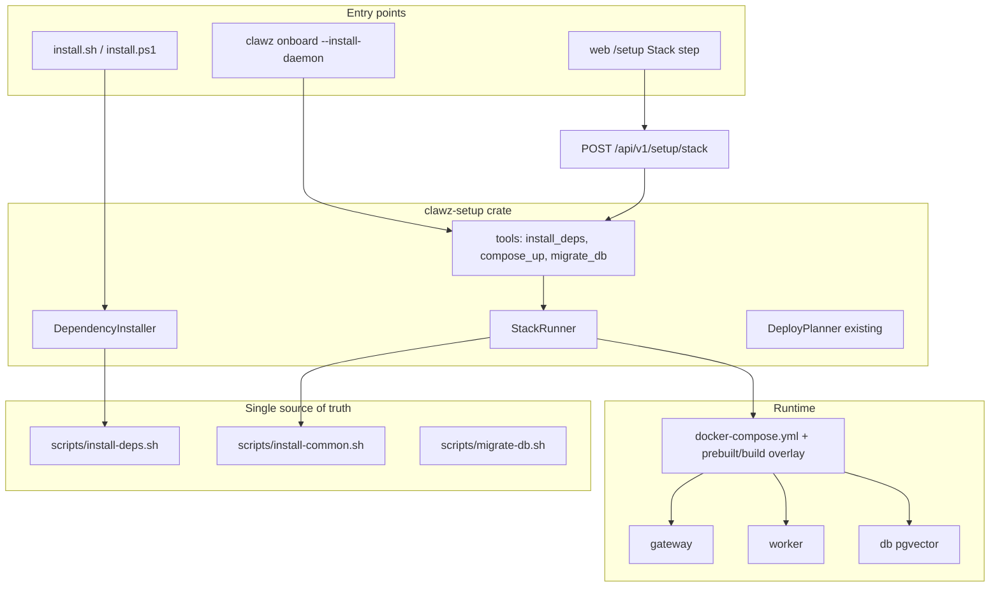

# Docker Bootstrap and Compose Deploy — Implementation Plan

**Document version:** 1.0  
**Date:** 2026-05-30  
**Status:** Implemented (2026-05-30)  
**Related:** [Install onboarding wizard design](2026-05-30-install-onboarding-wizard-design.md) · [Task tracker](../../install-onboarding-wizard-tasks.md) · [INSTALL.md](../../../INSTALL.md)

---

## Goal

One coherent flow on **Linux, macOS, and Windows**:

1. Install host prerequisites (Docker Engine / Docker Desktop, Compose v2, curl, optional Node for `--with-web`).
2. Pull or build images and start **gateway + worker + Postgres (pgvector)** via existing Compose files.
3. Run migrations, health checks, and onboarding (wizard).

**Recommended approach (already partially built):** host bootstrap scripts + Compose micro stack—not a meta-installer container.



## Implementation todos

| ID | Task | Status |
|----|------|--------|
| host-exec | Add `clawz-setup` HostScriptRunner + DependencyInstaller wrapping `install-deps.sh` (dry-run, confirm) | done |
| stack-runner | Add StackRunner + tools: `install_deps`, `compose_up`, `compose_down`, `migrate_db`; refactor `install-common.sh` | done |
| installers-os | Align `install.sh` + `install.ps1` (prebuilt pull, migrate, Windows Docker install helper) | done |
| cli-gateway-api | Add `clawz setup deps\|stack` CLI + `POST/GET /api/v1/setup/stack` with host-exec policy | done |
| web-stack-step | Wire `Setup.tsx` Stack step to setup/stack API or host command fallback | done |
| docs-tests | Update INSTALL.md, wizard tasks/spec; dry-run unit tests + setup_api stack tests | done |

---

## Current state (what we leverage)

| Asset | Location | Status |
|-------|----------|--------|
| Compose stack (micro) | [`docker-compose.yml`](../../../docker-compose.yml), [`docker-compose.prebuilt.yml`](../../../docker-compose.prebuilt.yml), [`docker-compose.build.yml`](../../../docker-compose.build.yml) | Done |
| Linux/macOS Docker auto-install | [`scripts/install-deps.sh`](../../../scripts/install-deps.sh) `ensure_docker()` | Done (Linux packages + macOS Homebrew cask) |
| Full Docker install path | [`scripts/install-common.sh`](../../../scripts/install-common.sh) `install_with_docker()` | Done |
| Deploy planner (overlays) | [`crates/clawz-setup/src/deploy.rs`](../../../crates/clawz-setup/src/deploy.rs) | Done (plan only; no execution) |
| Setup tools | [`crates/clawz-setup/src/tools/mod.rs`](../../../crates/clawz-setup/src/tools/mod.rs) | Partial: `spec_check`, `write_env`, `init_workspace` only |
| Windows Docker path | [`scripts/install.ps1`](../../../scripts/install.ps1) `Install-DockerStack` | **Manual** Docker Desktop required (no auto-install) |
| Wizard stack step | [Task tracker](../../install-onboarding-wizard-tasks.md) | **Open**: `compose_up`, `DependencyInstaller` |

## Architecture decisions

### 1. Single source of truth = shell scripts (via Rust subprocess)

Porting apt/brew/winget logic into Rust would duplicate [`install-deps.sh`](../../../scripts/install-deps.sh). Instead:

- Add **`HostScriptRunner`** in `clawz-setup` that runs allowlisted commands with `repo_root` as `cwd`, captures stdout/stderr, respects `ConfirmGate`.
- Scripts remain authoritative; Rust adds structure, dry-run, logging, and wizard/CLI API surfaces.

### 2. Bootstrap always runs on the **host**

A gateway container **cannot** install Docker on the host without privileged mounts. Rules:

| Surface | Can run `compose_up`? |
|---------|----------------------|
| `install.sh` / `clawz onboard` on host | Yes |
| Gateway in Compose (default) | No (unless `docker.sock` + repo bind-mount + explicit opt-in—out of v1 scope) |
| Web `/setup` | **Host-assisted**: call API only when `HostExecPolicy` allows; otherwise show copy-paste command |

**v1 web behavior:** Stack step calls `POST /api/v1/setup/stack` when gateway detects host exec (no `/.dockerenv`, or `CLAWZ_SETUP_ALLOW_HOST_EXEC=1`); otherwise returns `host_command` string for the operator to run locally.

### 3. Windows parity (staged inside v1)

- **Phase A:** Detect Docker Desktop + clear install link (current behavior).
- **Phase B:** Optional auto-install via `winget install Docker.DockerDesktop` or Chocolatey when available (with reboot/start prompts documented).
- Align `install.ps1` with `install-common.sh` sequence: `.env` → db → migrate → worker → gateway → health wait (today PS1 uses `compose build` only, not prebuilt pull path).

### 4. Deployment mode default

Docker packaging targets **`CLAWZ_MODE=micro`** (existing Compose default). Standalone (`--source`) stays a separate path; wizard "Stack" step only runs Compose when user chose micro/elastic.

---

## Implementation phases

### Phase 1 — `clawz-setup` host execution layer

**New module:** `crates/clawz-setup/src/host_exec.rs` (or `deploy/runner.rs`)

- Resolve `repo_root` from `CLAWZ_INSTALL_DIR`, env, or walk-up from `cwd` to find `docker-compose.yml`.
- `run_script(rel_path, args, dry_run) -> Result<HostExecOutput>`.
- Platform dispatch: `.sh` on Unix, `powershell -File` on Windows.

**New:** `crates/clawz-setup/src/deps.rs` — `DependencyInstaller`

- `install_all(dry_run, components)` → invokes `install-deps.sh` functions via sourced one-shot wrapper script **or** discrete exported functions:
  - `ensure_curl`, `ensure_docker`, `ensure_rust` (source only), `ensure_node` (if `with_web`).
- `dry_run`: print commands only (wizard preview panel).

### Phase 2 — Stack tools (wire deploy planner to scripts)

**New tools** under `crates/clawz-setup/src/tools/`:

| Tool | `requires_confirm` | Maps to |
|------|-------------------|---------|
| `install_deps` | yes | `ensure_docker` + friends |
| `compose_up` | yes | `install_with_docker` core (db → migrate → worker → gateway) |
| `compose_down` | yes | `docker compose down` |
| `migrate_db` | no | [`scripts/migrate-db.sh`](../../../scripts/migrate-db.sh) |

**New:** `StackRunner` uses [`DeployPlanner`](../../../crates/clawz-setup/src/deploy.rs) for overlay selection (prebuilt vs build), then builds `COMPOSE` argv from `plan.compose_file_args()`.

Extract shared bash functions from [`install-common.sh`](../../../scripts/install-common.sh) into callable units (minimal refactor):

- `clawz_compose_up(prebuilt|build)`
- `clawz_wait_for_gateway`

So `install.sh` and `StackRunner` call the same functions.

### Phase 3 — Thin installers (shell + PowerShell)

**[`scripts/install.sh`](../../../scripts/install.sh):**

- Add explicit `--bootstrap-only` (deps only) and ensure default path is: `ensure_docker` → `install_with_docker` → optional `--wizard`.
- Document one-liner in [`INSTALL.md`](../../../INSTALL.md).

**[`scripts/install.ps1`](../../../scripts/install.ps1):**

- Add prebuilt pull path (mirror `ensure_registry_auth` / `pull_prebuilt_images` or call shared bash via WSL when available—**prefer native** PowerShell compose pull using same env vars).
- Add `Install-DockerDesktop` helper (winget/choco) behind `-InstallDocker` flag.
- Run `migrate-db` equivalent before gateway.

### Phase 4 — CLI + gateway API (wizard parity)

**CLI** ([`crates/clawz-cli`](../../../crates/clawz-cli)):

- `clawz setup deps [--dry-run]`
- `clawz setup stack [--build] [--with-web] [--dry-run]`
- Wire `clawz onboard --install-daemon` to call `setup stack` after spec check when mode is micro.

**Gateway** ([`crates/clawz-gateway/src/routes/setup.rs`](../../../crates/clawz-gateway/src/routes/setup.rs)):

- `POST /api/v1/setup/stack` — body: `{ install_strategy, with_web, dry_run, confirm }`; requires bootstrap token + confirm for mutating ops.
- `GET /api/v1/setup/stack/status` — parse `docker compose ps` / health endpoints (read-only).
- Response includes `host_exec_allowed: bool` and `suggested_command` when blocked.

**Web** ([`web/src/pages/Setup.tsx`](../../../web/src/pages/Setup.tsx) Stack step):

- If API can exec: button "Install Docker and start stack".
- Else: show `curl ... | bash` / `.\scripts\install.ps1 -Docker` copy block + poll `/setup/stack/status`.

### Phase 5 — Doctor and task tracker

- Extend [`crates/clawz-setup/src/doctor.rs`](../../../crates/clawz-setup/src/doctor.rs) remediation text to reference `clawz setup stack`.
- Mark tasks in [install-onboarding-wizard-tasks.md](../../install-onboarding-wizard-tasks.md) §2.2, §4, §5.
- Add short section to [install-onboarding-wizard-design.md](2026-05-30-install-onboarding-wizard-design.md) § Stack / host exec policy.

### Phase 6 — Verification

| Test | Type |
|------|------|
| `DeployPlanner` + `compose_file_args` | Existing unit tests |
| `StackRunner` dry_run builds expected argv | New unit tests in `clawz-setup` |
| `install_deps` confirm gate | Registry test |
| Gateway `POST /setup/stack` dry_run | [`crates/clawz-gateway/tests/setup_api.rs`](../../../crates/clawz-gateway/tests/setup_api.rs) |
| Compose smoke | Existing [`scripts/compose-smoke.sh`](../../../scripts/compose-smoke.sh) in CI |

CI note: full Docker-in-Docker bootstrap is heavy; CI continues compose-smoke on runners with Docker preinstalled; unit tests use dry-run only.

---

## Operator flows (after implementation)

**Greenfield Linux server:**

```bash
export GITHUB_TOKEN=... GITHUB_USER=...
curl -fsSL https://github.com/improwyz/clawz/raw/main/install.sh | bash -s -- --docker --wizard
```

**From clone (any OS):**

```bash
./scripts/install.sh --docker --wizard   # Unix
.\scripts\install.ps1 -Docker            # Windows (+ manual/auto Docker Desktop)
```

**Wizard on host (micro):**

```bash
clawz onboard --install-daemon   # deps + stack + TUI wizard
```

**Wizard in browser (gateway already up):**

- Secrets/identity via `/setup`; stack step shows host command if gateway cannot exec.

---

## Out of scope (follow-ups)

- Kubernetes/Helm packaging (use existing gateway deploy adapters).
- Privileged "installer" container that mutates host Docker.
- Elastic multi-node Compose (single-node Compose only in v1).
- Auto-install Docker on Windows without user consent (always prompt).

---

## Risks and mitigations

| Risk | Mitigation |
|------|------------|
| Duplicating install logic | Subprocess to refactored `install-common.sh` only |
| Web wizard expects in-container bootstrap | `host_exec_allowed` + copy-paste fallback |
| GHCR auth failures | Reuse `ensure_registry_auth`; surface in setup API errors |
| Worker needs `docker.sock` | Document in INSTALL; compose already mounts socket |
| Sudo prompts on Linux | Wizard confirm step; `install-deps` uses `maybe_sudo` |
