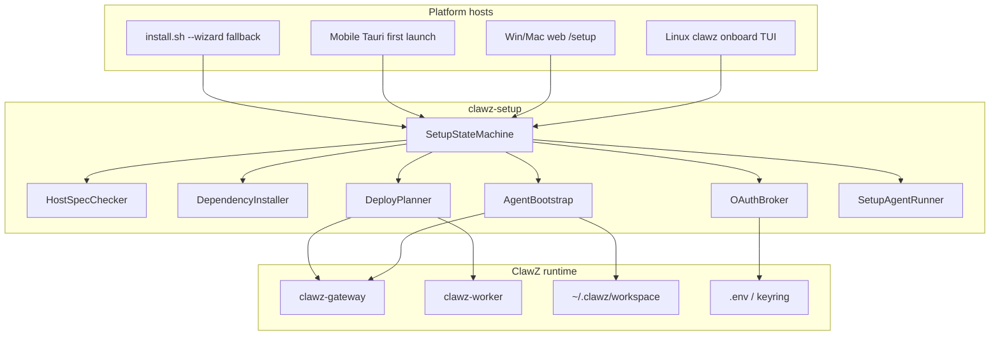
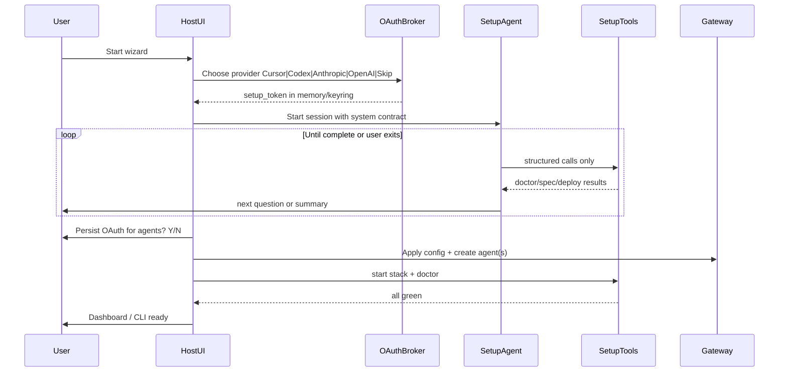

# ClawZ Installation & Onboarding Wizard — Design

**Document version:** 1.0  
**Date:** 2026-05-30  
**Status:** Approved for implementation  
**Task tracker:** [install-onboarding-wizard-tasks.md](../../install-onboarding-wizard-tasks.md)

---

## Context (what exists today)

| Surface | Today | Gap |
|---------|--------|-----|
| [`crates/clawz-tui/src/lib.rs`](../../crates/clawz-tui/src/lib.rs) | Prints `export` lines for port, keys, mode; no agent identity/skills; no stack start | Not a completion flow |
| [`crates/clawz-cli/src/onboard.rs`](../../crates/clawz-cli/src/onboard.rs) | Calls TUI; optional `gateway start` | No AI, no agent bootstrap |
| [`crates/clawz-cli/src/doctor.rs`](../../crates/clawz-cli/src/doctor.rs) | Env + gateway/worker/docker checks | No remediation / install |
| [`scripts/install.sh`](../../scripts/install.sh) + [`scripts/install-deps.sh`](../../scripts/install-deps.sh) | Clone, deps, prebuilt vs `--build`, compose up | No identity/LLM wizard; not linked to `clawz onboard` |
| [`scripts/init-workspace.sh`](../../scripts/init-workspace.sh) | Seeds `~/.clawz/workspace/AGENTS.md` + example skill | Not invoked from onboard |
| Web [`web/src/components/ShellBootstrap.tsx`](../../web/src/components/ShellBootstrap.tsx) | Tauri API init only | No `/setup` wizard |
| Gateway [`POST /agents/onboard`](../../crates/clawz-gateway/src/routes/agents.rs) | Goal → create agent (API) | Different from install wizard |

**Decisions (locked in):**

- **Platform entry:** Linux → TUI primary; Win/Mac → web-first; mobile → app-first; `install.sh` fallback everywhere.
- **AI model:** AI-first conversational wizard with OAuth at start; manual path always available.
- **OAuth v1:** Cursor + Codex + Anthropic + OpenAI (user picks one for setup agent).

---

## Goals & success criteria

**Done means:**

1. Operator completes wizard without reading INSTALL.md.
2. **Standalone:** one primary agent exists with identity (`who am I`), role (system prompt), workspace skills, and a working LLM provider.
3. **Micro / elastic:** gateway + worker(s) running; at least one agent (optionally a small team template); tenant/API keys set.
4. `clawz doctor` (or web equivalent) is all green.
5. OAuth credentials used for setup are either **discarded**, **setup-only**, or **promoted** to runtime per explicit consent (MSP / multi-tenant case).

---

## Recommended architecture

### 1. Shared setup engine (`clawz-setup` crate)

Extract wizard logic from ad-hoc TUI prints into a **single library** consumed by CLI, gateway HTTP API, and (later) Tauri IPC.

**Core types (conceptual):**

- `SetupSession { id, platform, mode: Standalone|Micro|Elastic, step, oauth_profile, consent }`
- `SetupEvent` — user answers, AI tool results, doctor outcomes
- `SetupArtifact` — `.env` patch, `cli.toml`, `AGENTS.md`, provider rows, agent CRUD payloads

**Persistence:** `~/.clawz/setup/session.json` (resumable); `setup_complete` flag in `~/.clawz/config.json` + gateway `UiSettings` when server-backed.

### 2. AI-first flow (with guardrails)

OAuth and provider selection happen **before** the conversational loop:

**Setup agent contract (fixed, not improvised):**

- May only mutate install state via **allowlisted tools** (no arbitrary shell).
- Must collect: deployment mode, image strategy (prebuilt vs build), identity block, role, skill selection, LLM routing.
- Must run `doctor` before declaring success.
- Destructive actions (sudo install, `docker compose up`, writing secrets) require **explicit user confirm** in UI/TUI (AI proposes; host enforces).

**SDK mapping:**

| Pattern | Use in wizard |
|---------|----------------|
| **Cursor SDK** `Agent.create` + `agent.send` + `run.stream` | Primary setup agent on dev machine (local `cwd` = repo or `~/.clawz`) |
| **Cursor SDK** trap: set `local` or `cloud` explicitly | Setup runs **local** on operator machine; cloud only for hosted installer SaaS later |
| **Codex** single `task` invocation | “Fix this doctor failure” rescue steps after user confirms write |
| **OpenCode** inline context | Every AI call includes full `DoctorReport`, OS spec, last 20 log lines — workers don’t read files |

**Provider wiring v1:**

- **Cursor:** `CURSOR_API_KEY` / OAuth → setup agent via `@cursor/sdk` or `cursor_sdk`.
- **Codex:** OpenAI Codex OAuth/token → setup agent via codex companion pattern (one-shot fix tasks).
- **Anthropic / OpenAI:** OAuth or API key → setup agent uses that provider **only for wizard** unless user opts in to persist as default LLM for ClawZ agents.

### 3. OAuth consent model (MSP-safe)

Three storage classes — user chooses at end (or per provider screen):

| Class | Env / store | Used for |
|-------|-------------|----------|
| **Setup-only** | `~/.clawz/setup/oauth.json` or session keyring namespace `clawz-setup` | Wizard + doctor fixes only; deleted on `setup_complete` if user selects |
| **Runtime default** | `.env` / gateway provider store | Default LLM for spawned agents |
| **Declined** | None | Manual keys in gateway Config UI; rule-based steps only |

**MSP flow:** “Skip OAuth — I’m configuring for a customer” → deterministic checklist; customer enters LLM keys in gateway Config / providers API.

### 4. Wizard steps (logical phases)

| Phase | Deterministic core | AI assists |
|-------|-------------------|------------|
| **0. Welcome** | Detect OS, RAM, CPU, disk, Docker, Rust, Node | Explain tradeoffs prebuilt vs build |
| **1. Deploy mode** | `standalone` / `micro` / `elastic` | Recommend based on spec |
| **2. Install strategy** | Prebuilt GHCR vs `--build`; invoke `install-common.sh` | Offer to run `install-deps.sh` with sudo |
| **3. Stack** | Compose up / source run; migrations `migrate-db.sh` | Parse compose/doctor errors |
| **4. Platform secrets** | JWT, API keys, worker token | Generate + write `.env` |
| **5. LLM** | Provider + model; test completion | OAuth or paste key |
| **6. Agent identity** | Name, “who am I”, role, tone; write `AGENTS.md` | Draft persona from user blurb |
| **7. Skills** | List workspace skills; seed via `init-workspace.sh` | Suggest skills for role |
| **8. Agent topology** | Standalone: 1 agent. Micro/elastic: templates | Explain team budgets |
| **9. Verify** | `clawz doctor` + smoke execute | Fix loop (max 3) |
| **10. Complete** | Set `setup_complete`, open dashboard | Summary + next steps |

### 5. Platform hosts

| Platform | Primary | Implementation |
|----------|---------|----------------|
| **Linux server** | TUI | Upgrade `clawz-tui` to ratatui multi-step UI calling `clawz-setup`; stdin fallback for SSH |
| **Windows / macOS** | Web | `web/src/pages/Setup.tsx` + gateway `POST /api/v1/setup/*`; redirect when `!setup_complete` |
| **iOS / Android** | App | `clawz-tauri-mobile` first-launch → embedded `/setup` |
| **All** | Fallback | `./scripts/install.sh --wizard` → `clawz onboard --json` |

### 6. Multi-agent (micro / elastic)

**Templates (v1):**

- **Single ops agent** — one `AgentConfig` with full tool set.
- **Orchestrator + worker** — planner + executor; team metadata via `TeamCoordinator`.
- **Custom** — wizard collects N names/roles; gateway batch create.

### 7. Dependency & spec checking

Extend `clawz doctor` via shared `HostSpecChecker`:

- RAM thresholds per mode (e.g. 4GB standalone, 8GB micro)
- Disk free ≥ 10GB for build path
- `docker info`, compose v2, `rustc` ≥ 1.87, optional Node for web
- GHCR auth when prebuilt

**Auto-install:** `DependencyInstaller` wraps `install-deps.sh` with dry-run preview, sudo only after confirm, idempotent re-run.

### 8. API surface (for web/mobile)

- `GET /api/v1/setup/status`
- `POST /api/v1/setup/session`
- `POST /api/v1/setup/answer`
- `POST /api/v1/setup/oauth/callback`
- `POST /api/v1/setup/apply`
- `POST /api/v1/setup/complete`

Web wizard uses SSE for AI streaming (reuse run-events patterns).

### 9. Security & compliance

- Setup routes require **bootstrap token** until `setup_complete`.
- Never log raw API keys; mask in TUI/web.
- PRISM-G audit on `setup.apply` and agent creation.
- OAuth: keyring preferred on desktop; `.env` for Docker export.

### 10. Approaches considered

| Approach | Pros | Cons |
|----------|------|------|
| **A. AI-first + shared engine (chosen)** | One brain, many UIs; strong error recovery | OAuth + tool sandbox complexity |
| **B. Deterministic-only** | Simpler, MSP-friendly | Weak on install errors |
| **C. Web-only everywhere** | One UI | Poor on headless Linux |

**Recommendation:** A with deterministic fallback when OAuth skipped or AI unavailable.

---

## Implementation phases (summary)

| Phase | Focus | Exit criteria |
|-------|--------|---------------|
| **1** | `clawz-setup` + Linux TUI + install.sh | `clawz onboard` → stack up, doctor green, one agent |
| **2** | Web wizard Win/Mac | `/setup` completes without CLI |
| **3** | Full AI + OAuth + multi-agent + Codex rescue | AI-first path production-ready |
| **4** | Mobile + Windows PS1 wizard | App first-launch works |

See [install-onboarding-wizard-tasks.md](../../install-onboarding-wizard-tasks.md) for granular checklist.

---

## Key files (implementation)

- New: `crates/clawz-setup/`
- Extend: `crates/clawz-tui/`, `crates/clawz-cli/`, `scripts/install.sh`
- New: `crates/clawz-gateway/src/routes/setup.rs`
- New: `web/src/pages/Setup.tsx`

---

## Open items

- Exact OAuth flows per provider (device code vs browser redirect) — follow vendor docs at implementation.
- Setup agent: **sidecar CLI subprocess** on Linux first (recommended); in-process gateway later.
