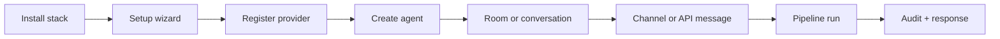
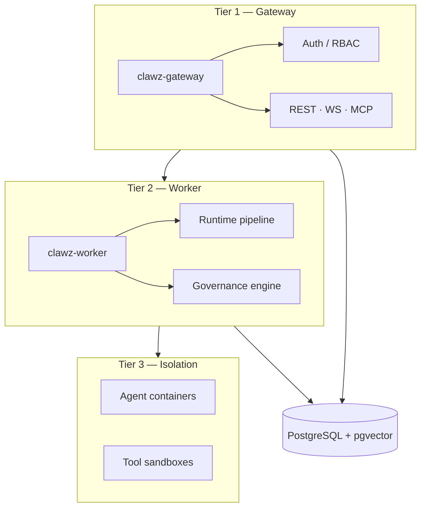
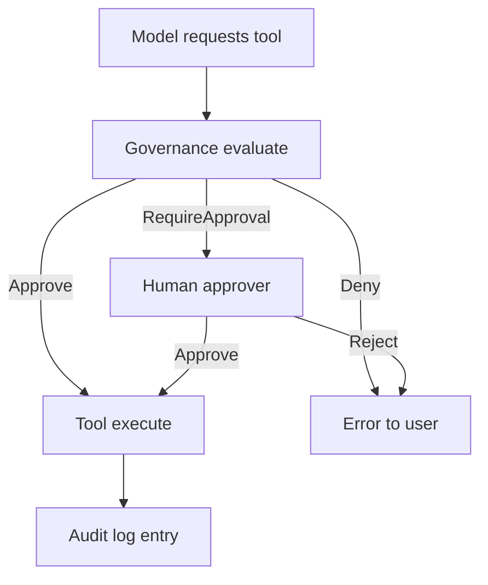

# ClawZ User Manual

**Version:** 1.0  
**Audience:** Operators, developers, and product owners who run agents day to day  
**Companion documents:** [Administration Manual](administration-manual.md) · [API Reference](api-reference.md) · [INSTALL.md](../INSTALL.md)

---

## 1. Overview

### Purpose

ClawZ exists so organizations can run autonomous AI agents in production without treating governance, audit, and isolation as afterthoughts. The platform is the reference implementation of the PRISM-G framework: every agent action passes through a structured runtime pipeline where policies, trust scores, and approval workflows can approve, reject, or escalate before tools touch your systems. This manual explains how to install ClawZ, create agents, configure their behavior, and operate them through the web dashboard, CLI, and HTTP API.

### Product summary

ClawZ is a Rust-based agent orchestration platform published by Enterpryz Ventures under the Elastic License 2.0. At its core are two cooperating services: the **gateway**, which exposes REST, WebSocket, and MCP interfaces and handles authentication and tenant routing, and the **worker**, which executes agents through reversible pipeline steps, coordinates teams and subagents, and enforces guardrails. Optional surfaces include a React web dashboard, the `clawz` CLI, a Tauri desktop shell, and embedded firmware support for edge devices. Data persists in PostgreSQL with pgvector for embeddings when you deploy in micro or elastic mode.

### Problem solved

Most agent prototypes fail in production because they run as a single long-lived process with unconstrained tool access, no tamper-evident audit trail, and no clear multi-tenant boundary. ClawZ addresses that gap by containerizing agent workloads, recording a hash-chained audit log, and embedding compliance checks in the hot path of execution. Operators gain a single place to register providers, define agents, run conversations and rooms, attach channels such as Slack or webhooks, and demonstrate who did what and when.

### Target users

The primary user is a **platform operator** or **AI engineer** responsible for standing up ClawZ, connecting LLM providers, and defining agents for internal or customer-facing workflows. Secondary users include **compliance reviewers** who read audit exports, **support engineers** who monitor rooms and conversations, and **integration developers** who call the HTTP API from other systems. Casual chat users are supported through the dashboard, but the product’s strength is operational control rather than a minimal chat UI.

### Key capabilities

You can define agents with models, system prompts, and tool access; run single-turn or multi-step tasks; spawn subagents and teams; participate in multi-participant **rooms** with sequenced messages; store conversation history and vector embeddings for retrieval-augmented generation; route inbound messages from channels; schedule recurring jobs with cron; and deploy agents to multiple cloud targets from the gateway. Governance features evaluate actions against PRISM-G dimensions, maintain trust tiers, and support approval councils. Observability includes Prometheus metrics, structured logs, and dashboard summaries.

### Supported use cases

Typical deployments include governed internal copilots, customer-support agent rooms with escalation to humans, MSP-managed stacks per tenant, dev-platform agents with sandboxed shell and browser tools, and document workflows that combine RAG with policy checks. ClawZ micro mode (Docker Compose with gateway, worker, and Postgres) is the default for teams starting on a single VPS; elastic mode adds mesh networking for larger fleets.

### Out of scope

ClawZ is not a general-purpose low-code workflow designer for non-technical users, a hosted SaaS with multi-region tenancy managed by Enterpryz, or a replacement for your existing SIEM or GRC suite—it exports evidence and integrates with your processes but does not certify your organization. Fine-tuning or training foundation models is out of scope; you bring provider API keys. The gateway TUI is intended for development debugging, not day-two production operations.

---

## 2. Getting Started

### Prerequisites

Before installation, ensure you have Git available. For the recommended Docker path you need Docker Engine and Compose v2; the installer can install Docker on Linux and macOS when missing. Prebuilt images pull from GitHub Container Registry and require a personal access token with `read:packages` plus your GitHub username in `GITHUB_TOKEN` and `GITHUB_USER`. For source-only installs you need Rust 1.87 or newer. Building the web dashboard additionally requires Node.js 20 or later. Windows operators use PowerShell 5.1 or newer.

### Sign-up and workspace setup

ClawZ does not use a centralized cloud sign-up in the open-source distribution. Your **workspace** is the combination of a ClawZ installation directory, the `~/.clawz` operator data folder, and optionally a tenant identifier in configuration. First-time setup is driven by the web wizard at `/setup` or by `clawz onboard` on Linux. The wizard collects deployment mode (standalone, micro, or elastic), install strategy (prebuilt images, local build, or source), stack bootstrap, secrets, LLM provider credentials, and agent identity fields. When setup completes, a flag in `~/.clawz/config.json` marks onboarding finished and the dashboard becomes the main entry point.

### First agent creation

After the gateway is healthy at `http://localhost:3000`, create an agent through the dashboard or API. A minimal agent requires a name, a model identifier (for example `stub` in development with `CLAWZ_STUB_PROVIDER=1`), and a system prompt. In production you register a provider first via `POST /api/v1/providers` with your API key, then reference that provider when creating the agent. The gateway stores agent metadata and delegates execution to the worker when you send a message or call the run endpoint.

### Quickstart tutorial

Clone or install the repository, run `./scripts/install.sh` with registry credentials exported, wait for the health check, then open `http://localhost:3000/setup` to finish the wizard. Create an agent named `hello-agent` with a short system prompt. Send a test message with `clawz agent -m "Hello"` if the CLI is on your PATH, or use `POST /api/v1/agents/{id}/run` with your API key. Confirm the response in the dashboard or via `curl http://localhost:3000/api/v1/system/health`. Run `clawz doctor` to verify gateway, worker, and Docker connectivity.

### Basic concepts

An **agent** is a configured autonomous worker with identity, model routing, and tools. A **conversation** (or **room**) holds ordered messages between participants; rooms support multiple agents and humans. A **provider** is an LLM backend such as OpenAI or Anthropic. A **tool** is an executable capability registered in the worker. **Governance** refers to PRISM-G policy evaluation and audit. A **tenant** isolates data and API keys in multi-tenant deployments. The **pipeline** is the ordered execution path: load context, check governance, call the model, execute tools, persist results.

### Sample workflow

A support lead creates a micro deployment, completes setup with Anthropic as the LLM provider, and defines an agent “Tier-1 Support” with a system prompt describing tone and escalation rules. They create a room, invite the agent as leader, and connect a Slack channel. When a customer message arrives, the channel adapter posts into the room; the worker runs the pipeline, retrieves relevant articles from pgvector memory, and replies. If the agent requests a restricted tool, governance requires approval; a human approves via the governance API, and execution continues with an audit entry appended to the chain.

---

## 3. Product Architecture

### System overview

ClawZ follows a three-tier service model aligned with how enterprises actually deploy AI: clients talk to the gateway; the gateway authenticates and schedules work on workers; workers run pipelines and spawn isolated agent and tool containers. Shared types and traits live in `clawz-core`, while DTOs and execution clients live in `clawz-services`. This separation keeps the HTTP surface stable while allowing worker logic to evolve independently.

### Core components

The **gateway** (`clawz-gateway`) is an Axum application exposing `/api/v1/*` routes for agents, conversations, rooms, channels, governance, providers, tools, fleet, setup, cron, and cloud deploy. It validates JWT or API keys, enforces tenant scope, and forwards execution to the worker control API at `WORKER_URL`. The **worker** (`clawz-worker`) hosts the agent runtime, mesh coordination, memory and RAG, provider adapters, and tool registry. **clawz-setup** powers the install wizard and host bootstrap scripts. The optional **web** dashboard consumes the same APIs as external clients.

### Agent lifecycle

An agent begins in an idle state when created. When a run is requested, the worker transitions through pipeline steps: gathering context and history, evaluating governance, invoking the configured provider, executing any returned tool calls, and persisting messages and costs. The agent may pause for approval, spawn subagents, or complete with a final message. Stop and status endpoints allow operators to interrupt long runs. History endpoints expose prior turns for debugging and compliance review.

### Data flow

Inbound HTTP or WebSocket requests hit the gateway, which resolves identity and loads agent and tenant context from Postgres when configured. The gateway calls the worker with the shared `CLAWZ_WORKER_TOKEN`. The worker loads conversation memory, may query pgvector for RAG chunks, calls the LLM provider through a circuit breaker, executes tools in sandboxes, writes results to the database, and returns structured output to the gateway. Audit entries for governance decisions are appended to the hash chain in parallel with business logic.

### Model and provider architecture

Providers are registered in the gateway with type, API key, and optional base URL. The worker’s provider registry routes requests by model name, applies rate limits and cost tracking, and retries with backoff when the circuit breaker allows. You can mix cloud models and local inference (Ollama) in the same deployment by registering multiple providers and assigning different agents to different models. Stub providers support CI and local development without external API calls.

### Integration architecture

External systems integrate through REST, WebSocket room streams, MCP, and inbound webhooks on `/webhooks/{channel_type}/{channel_id}`. Outbound integrations use the connectors subsystem (CRM, issue trackers, messaging platforms) and channel plugins. Telephony integrations bind phone numbers to agents and receive Twilio or Google Voice callbacks at public URLs defined by `CLAWZ_PUBLIC_URL`. Cloud deploy adapters provision gateway or worker images to third-party hosts without manual image copying.

---

## 4. AI Agent Concepts

### Agent roles

Agents are not limited to a single “assistant” persona. In rooms, an agent may be designated **leader**, **participant**, or specialized subagent spawned for a subtask. Roles affect orchestration: leaders coordinate replies; participants contribute in parallel; subagents inherit constrained permissions and budgets from parents. System prompts and identity artifacts (`AGENTS.md` in the workspace) define how the agent describes itself and its duties.

### Instructions and prompts

The **system prompt** is the primary behavioral contract. It should state scope, tone, forbidden actions, and when to escalate. ClawZ does not replace prompt engineering; it enforces that instructions are attached to agent records and passed consistently on every pipeline invocation. Identity fields collected during setup (name, “who am I,” role) are merged into workspace files for reproducibility across restarts.

### Tools and actions

Tools are named capabilities with JSON parameter schemas. When the model returns a tool call, the worker validates the schema, runs governance checks for that action type, and executes in a sandbox where appropriate. Built-in tools include file access, HTTP requests, shell commands, browser automation, Docker operations, and MCP bridges. Custom tools register through `POST /api/v1/tools` with schema metadata.

### Memory and context

Conversation history is stored per thread or room with server-assigned sequence numbers for ordering. Embeddings may be generated for similarity search during RAG steps. Context windows are bounded by model limits; the pipeline selects recent messages and retrieved chunks. Operators configure retention through database practices and deployment policies described in the Administration Manual.

### Knowledge sources

Knowledge enters the system through file ingestion into workspace directories, vector indexing in Postgres, connector pulls from SaaS systems, and manual message content. Retrieval settings (top-k, similarity thresholds) are influenced by worker configuration and agent design rather than a single global slider in the UI.

### Autonomy levels

Trust tiers from **Untrusted** through **Full** adjust how much autonomy an agent has: untrusted agents require senior approval for most actions; full-trust agents run with monitoring only. Policies map PRISM-G dimensions to thresholds. Autonomy is therefore a governance outcome, not merely a model temperature setting.

### Human-in-the-loop

When governance returns **RequireApproval**, execution pauses until approvers vote through the council workflow or an operator approves via API. Rooms support human participants alongside agents. Side-threads allow private human discussion before promoting a message to the main room timeline.

---

## 5. Features

### Chat and task execution

Single-agent chat is available through conversations API and `clawz agent -m "..."`. Multi-turn tasks reuse stored history. Long-running work uses asynchronous room turns: posting a message returns `202 Accepted` while the agent processes in the background. WebSocket endpoints stream room events for live UIs.

### Multi-step workflows

The pipeline natively supports tool loops: the model may call tools, receive results, and continue until a stop condition. Fan-out and batch endpoints run multiple agents or invocations in parallel with aggregated results. Workflow DAG execution exists in the worker for advanced orchestration scenarios.

### Retrieval and knowledge base

pgvector-backed storage enables similarity search over embedded documents. RAG steps augment prompts with retrieved chunks before the provider call. Operators must ensure embeddings dimensions match configuration (`pgvector_dimensions` in config) and that ingestion jobs keep content fresh.

### Integrations

Thirty-plus connectors and channel types connect ClawZ to external SaaS and messaging systems. Each channel registers with an agent binding and optional polling interval. Webhooks receive inbound events; the gateway supervisor dispatches them to the correct agent context.

### Notifications

Channel adapters deliver outbound notifications (Slack messages, SMS via Twilio, etc.). Cron jobs can trigger periodic agent runs that email or post summaries when integrated through tools or connectors.

### Collaboration

Rooms support multiple participants, side-threads, message promotion, and orchestration endpoints to coordinate agent teams. Conversations bridge legacy single-thread UX to the room model by sharing identifiers.

### Analytics and logs

The dashboard exposes overview metrics. Prometheus scrapes `/metrics` on the gateway. Execution logs and governance audit entries support forensic review. Cost records attach token usage and estimated spend per request for chargeback.

---

## 6. User Guide

### Dashboard overview

The React dashboard at `http://localhost:3000` (or your deployed host) lists agents, fleet status, governance summaries, tools, and monitoring views when built with `--with-web`. First visit redirects to `/setup` until onboarding completes. Navigation follows the ClawZ design system (dark theme, silver branding on dark backgrounds).

### Creating an agent

Use the Agents page or `POST /api/v1/agents` with JSON body containing `name`, `model`, optional `description`, and `system_prompt`. Assign a provider by model name or explicit configuration depending on your deployment. Save the returned `id` for subsequent runs and channel bindings.

### Configuring behavior

Edit system prompts and model selection through agent update endpoints. Attach skills from the workspace `skills/` directory. Register tools globally then allow them per agent through governance policy. Identity and workspace files under `~/.clawz/workspace` supplement prompts with durable persona text.

### Running tasks

Trigger execution with `POST /api/v1/agents/{id}/run` and a message payload, the CLI `clawz agent` command, or a room message post. For autonomous loops, `POST /api/v1/agents/{id}/autonomous` runs until stop conditions. Monitor status with `GET /api/v1/agents/{id}/status`.

### Reviewing outputs

Read responses in the dashboard conversation view, room message list, or API history endpoints. Run events and session transcripts provide compact views for long traces. Compare governance audit entries when a run was denied or modified.

### Managing conversations

List conversations with pagination filters. Messages store roles (user, assistant, system) and metadata. Deletion and retention policies depend on your database administration practices.

### Exporting results

Export audit logs and conversation data through database tools or custom scripts calling list endpoints with time filters. Governance export endpoints support compliance-oriented formats described in the Administration Manual.

---

## 7. Prompt and Behavior Design

### System prompts

Write system prompts as operational contracts: scope, sources of truth, escalation paths, and refusal rules. Avoid vague values language; specify what the agent must verify before acting. ClawZ repeats the system prompt on every pipeline invocation, so length counts against context limits—prefer dense instructions over repetitive disclaimers.

### Prompt templates

Organize reusable templates in workspace files or your internal git repository. Version templates alongside agent definitions. The setup wizard seeds initial identity text; promote changes through agent PATCH operations or workspace `AGENTS.md` updates.

### Variables and placeholders

Use clear delimiters for dynamic fields (customer name, ticket id) in user messages rather than embedding unresolved placeholders in the system prompt unless your integration layer substitutes them before the API call. The gateway does not automatically resolve Mustache-style variables in prompts today; application code should expand them at send time.

### Response formatting

Instruct the model to return structured JSON when downstream tools parse output. Specify markdown or plain text for human channels. Room participants benefit from concise replies with explicit next steps.

### Fallback behavior

Define what the agent should do when retrieval returns no documents, when the provider times out, or when governance denies an action. Fallbacks should default to safe, non-destructive responses and human escalation rather than hallucinated facts.

### Escalation rules

Document when to `@human` in rooms, open side-threads, or call approval workflows. Tie escalation to trust tier: low-trust agents escalate sooner. Telephony and SMS channels should include explicit spoken disclaimers where regulations require.

### Prompt versioning

Store prompt history in git. When changing production prompts, run evaluation passes (see section 15) and update agent records during a maintenance window. Record prompt version identifiers in message metadata when your integration supports custom fields.

---

## 8. Knowledge Base

### Data sources

Authoritative sources should be named in the system prompt. ClawZ can ingest workspace files, connector payloads, and uploaded content referenced by tools. Do not treat the model weights as a knowledge source.

### File ingestion

Place files under the operator workspace or use tool actions to read paths inside allowed directories. Sandboxing limits which paths are visible. Large corpora should be chunked and embedded rather than pasted into prompts wholesale.

### Connectors

Connectors pull data from external systems (Notion, GitHub, CRM, etc.) on schedules or events. Configure credentials through gateway connector settings and scope them per tenant.

### Indexing and sync

Embeddings are stored in pgvector. Reindex when source documents change materially. Sync jobs should be idempotent to avoid duplicate chunks.

### Retrieval settings

Similarity search parameters are configured in worker memory modules. Test retrieval quality with representative queries before enabling autonomous customer-facing agents.

### Chunking and embeddings

Chunk size and overlap affect recall. Use embedding models consistent with `pgvector_dimensions`. OpenAI and Ollama embedding adapters exist in the worker.

### Freshness and update policy

Define SLAs for how stale knowledge may be. Automated sync plus periodic audits prevents agents from citing withdrawn policies.

---

## 9. Tools and Integrations

### Supported integrations

See the gateway `connectors/` and `channels/` modules for the current matrix. Capabilities expand with releases; consult [AGENTS.md](../AGENTS.md) for subsystem lists.

### Authentication setup

Connectors and channels store OAuth tokens or API keys encrypted when `CLAWZ_SECRETS_KEY` is set. Setup wizard OAuth flows store tokens in a setup vault until promoted to runtime providers.

### Permissions

Tool execution respects governance policies and OS-level sandboxing. Docker tools require socket access on the worker host. Browser tools need CDP endpoints.

### Action schemas

Register tools with JSON Schema parameters. Invalid tool calls are rejected before execution.

### Webhooks

Inbound webhooks hit public gateway routes; validate signatures (Twilio, etc.) as configured. Set `CLAWZ_PUBLIC_URL` to your HTTPS origin.

### API connectors

Custom integrations may call ClawZ REST APIs with tenant-scoped API keys instead of using built-in connectors.

### Failure handling

Circuit breakers trip on repeated provider or tool failures. Half-open state tests recovery before full traffic resumes. Logs include error codes for support.

---

## 10. Workflows and Automation

### Trigger types

Triggers include manual API calls, inbound channel messages, cron schedules, room orchestration events, and telephony callbacks.

### Workflow builder

Complex DAG workflows are configured in worker orchestration modules rather than a drag-and-drop UI. Developers define steps in code or configuration consumed by the worker.

### Approval steps

Insert governance policies that return `RequireApproval` for sensitive tools. Council votes collect approver decisions before resume.

### Scheduled runs

`clawz cron add` and `/api/v1/cron/jobs` define schedules. Jobs target agents by id with message payloads.

### Event-driven runs

Webhooks and channel supervisors enqueue runs when external events arrive.

### Retry logic

Provider calls retry with exponential backoff within circuit breaker limits. Cron jobs may be retried manually after failure.

### Exception handling

Failed pipeline steps roll back prior side effects where rollback handlers exist. Unhandled errors return structured API errors and log stack traces server-side.

---

## 11. Administration

### Workspace settings

Your operator workspace lives under `~/.clawz/workspace` by default, containing `AGENTS.md`, skills, and files agents may read through sanctioned tools. Override the base path with `CLAWZ_HOME` when running multiple logical environments on one machine. The setup wizard writes session progress to `~/.clawz/setup/session.json`; do not delete this file mid-onboarding unless you intend to restart setup from the beginning.

### Team and roles

API keys encode identity as `hash:user_id:role:tenant_id`. Roles such as `owner` unlock administrative API routes; narrower roles should be issued to integrations that only run agents or read conversations. Dashboard users authenticate with JWTs that carry `tenant_id` claims. Ask your platform administrator for a key matrix that matches your org chart.

### Access control

Never use `CLAWZ_DISABLE_AUTH=1` outside local development. Production access should flow through HTTPS with keys stored in a secret manager. If an integration leaks a key, rotate it in `VALID_API_KEYS` immediately and review audit logs for that tenant.

### Usage policies

Your organization may publish acceptable-use rules for agents (no unsupervised financial transactions, no PII in public channels). ClawZ enforces technical policy through governance YAML; behavioral policy remains a human and process concern documented alongside agent prompts.

### Tenant settings

When `CLAWZ_TENANT_ID` is set on the gateway, default-created records align to that tenant. Multi-tenant SaaS operators issue per-customer API keys with distinct tenant fields instead of sharing one global tenant.

### Branding

The web dashboard uses assets in `web/public/branding/`. Custom branding requires rebuilding the web container or static bundle; there is no runtime theme upload in the open-source distribution today.

### Audit controls

Every governance decision can append to the hash-chained audit log. As a user, you can request exports through your administrator when investigating a denied tool call or unexpected agent message. See the Administration Manual for chain verification procedures.

---

## 12. Security and Privacy

### Data handling

Messages, embeddings, and audit entries reside in Postgres in micro and elastic deployments. Treat the database as confidential. Avoid pasting secrets, credentials, or unredacted customer PII into prompts because they may be logged and embedded.

### Encryption

ClawZ expects you to encrypt database volumes and terminate TLS at your reverse proxy. Provider API keys may be encrypted at rest when `CLAWZ_SECRETS_KEY` is configured on the gateway.

### Authentication and SSO

Dashboard login uses `/api/v1/system/auth/login`. Enterprise SSO typically fronts the dashboard with an identity proxy; consult your administrator for the approved pattern.

### Authorization

If you receive 403 responses, your API key role may lack permission for that route. If you receive 401 responses, the key is missing or invalid.

### Secrets management

Store `CLAWZ_API_KEY` and provider keys in CI secret stores, not in repository files. The CLI reads environment variables; shell history may capture exports—prefer `.env` files with restrictive permissions excluded from git.

### Data retention

Retention duration is defined by your operator, not by a single ClawZ default. Ask when conversation history is purged if you handle regulated data.

### Privacy controls

Exercise data subject rights through your administrator, who executes tenant-scoped deletion in the database and workspace files.

### Compliance notes

ClawZ supplies technical controls; organizational certification (SOC 2, GDPR programs) remains your responsibility. Use audit exports as evidence inputs, not as automatic certification.

---

## 13. Safety and Guardrails

### Allowed actions

Your agent’s allowed tools and channels are defined by governance policies and agent configuration. If an action is blocked, the API returns an error and an audit entry explains the denial reason.

### Restricted actions

Destructive tools (shell, Docker, arbitrary HTTP) are commonly restricted for new or low-trust agents. Request policy changes through your security team rather than bypassing checks.

### Content filtering

Output constraints may truncate or reject model responses that violate policy. If legitimate content is blocked, refine prompts and policies together with administrators.

### Tool-use guardrails

Each tool call runs through the same governance engine as messages. Expect delays when human approval is required.

### Rate limits

Heavy automation may hit admission or provider rate limits. Back off exponentially and contact administrators to raise quotas if your use case is approved.

### Human approval gates

When status shows pending approval, approvers must act via dashboard, WebSocket, or governance API before the run continues.

### Abuse prevention

Report compromised keys immediately. Disable agents that exhibit anomalous tool patterns.

---

## 14. Model Management

### Supported models

Models are determined by registered providers. Your administrator publishes which model ids are approved for production agents.

### Model selection rules

Choose models that match latency, cost, and capability needs. Vision or long-context models cost more; use them only when required.

### Temperature and parameters

Lower temperature yields more deterministic support answers; higher temperature suits brainstorming internal tools. Parameters are set per agent or provider configuration exposed in your deployment.

### Provider failover

When a provider is down, switch agents to a backup model id documented in your runbook, or pause customer-facing agents until recovery.

### Token limits

Large histories and RAG chunks consume context. Compact sessions with `/api/v1/sessions/{id}/compact` when transcripts grow unwieldy.

### Cost controls

Budget denials appear at persist time when daily or monthly caps are exceeded. Review dashboard cost metrics if runs stop unexpectedly.

### Version changes

Provider deprecations are announced in vendor release notes; update agent `model` fields before sunset dates.

---

## 15. Evaluation and Quality

### Success metrics

Define measurable outcomes: ticket deflection rate, average handle time, citation accuracy, or human takeover rate. Review weekly during early deployments.

### Evaluation datasets

Curate golden questions with expected citations from your knowledge base. Run after every material prompt or RAG change.

### Test cases

Automate smoke tests that call `POST /agents/{id}/run` with fixed prompts in CI against a staging stack.

### Accuracy checks

Sample production transcripts with human reviewers; redact PII before sharing outside the compliance team.

### Hallucination checks

Require agents to quote retrieved chunk ids or titles when answering policy questions.

### Latency benchmarks

Track p95 time-to-first-token separately from end-to-end tool loops; regressions often indicate provider or retrieval issues.

### Regression testing

Block releases when golden-set accuracy drops beyond an agreed threshold.

---

## 16. Monitoring and Observability

### Usage dashboards

The dashboard overview summarizes agents, runs, and fleet health. Use it for daily standups; drill into Prometheus for trends.

### Execution logs

Worker and gateway logs include request ids when OpenTelemetry is enabled. Correlate logs with audit entry timestamps during incidents.

### Trace views

Distributed traces show provider and tool spans. Ask administrators to enable sampling appropriate for your traffic volume.

### Error tracking

Spikes in 5xx or governance denials warrant investigation before customers notice quality degradation.

### Alerting

Subscribe to alerts your operations team configures on metrics and logs; ClawZ does not email you by default.

### Cost monitoring

Review per-tenant spend if chargeback applies. Unexpected spikes often trace to autonomous loops or fan-out jobs.

### Performance monitoring

Slow RAG usually means missing indexes or oversized chunks; slow tools may mean network egress limits.

---

## 17. API Documentation

The [API Reference](api-reference.md) documents every major `/api/v1` route with curl, Python, and JavaScript examples. Open interactive docs at `/api/docs` on your gateway host. Authenticate automation with `X-API-Key` and dashboard scripts with JWT Bearer tokens unless your administrator standardizes on one method.

---

## 18. Deployment and Environments

### Environment setup

Development stacks may use SQLite or stub providers; production should use Postgres, real providers, and TLS. Never copy production database dumps to laptops without redaction.

### Configuration variables

See `.env.example` for the full list. `CLAWZ_MODE` selects standalone, micro, or elastic behavior.

### Dev, staging, prod

Promote configuration through git and infrastructure-as-code. Test migrations on staging before production `deploy.sh` runs.

### Hosting model

Single-node Compose suits small teams. Larger teams add worker replicas and external Postgres HA.

### Release process

Use `./scripts/deploy.sh` for image updates. Read release notes before bumping `CLAWZ_IMAGE_TAG`.

### Rollback plan

Keep previous image tags and database backups addressable within your RTO.

### Infrastructure dependencies

Ensure outbound HTTPS to LLM vendors and inbound HTTPS for webhooks before go-live.

---

## 19. Troubleshooting

### Common issues

“Connection refused” on port 3000 means the gateway is not running or is bound elsewhere. Database connection errors on startup mean Postgres is not ready or `DATABASE_URL` is wrong.

### Agent not responding

Confirm the worker container is healthy, `WORKER_URL` resolves from the gateway, and `CLAWZ_WORKER_TOKEN` matches on both sides. Check governance audit for silent denials.

### Incorrect answers

Refresh knowledge sources and verify retrieval returns relevant chunks. Prompt changes fix tone and policy adherence more often than infrastructure changes.

### Tool failures

Read worker logs for sandbox denials, missing Docker socket, or MCP timeouts.

### Sync delays

Channel polling intervals and webhook delivery latency affect perceived responsiveness.

### Permission errors

Ensure your API key tenant matches the agent or conversation tenant id.

### Debug checklist

Run `clawz doctor`, `curl /health`, inspect `docker compose ps`, and reproduce with a minimal `POST /agents/{id}/run` payload.

---

## 20. Support and Operations

### Support channels

Community support is available via GitHub issues on the improwyz/clawz repository. Enterprise customers coordinate with Enterpryz Ventures under separate agreements.

### SLAs

Self-hosted operators define their own availability targets. Document who is on-call for gateway and database incidents.

### Incident response

During incidents, preserve audit logs, capture container logs, and rotate API keys if compromise is suspected.

### Maintenance windows

Announce downtime before database migrations or gateway upgrades. Drain long-running autonomous sessions when possible.

### Backup and recovery

Verify Postgres backups restore successfully; agent configuration without the database is incomplete.

### Business continuity

Maintain runbooks for provider outages and region failures if you depend on a single LLM vendor.

---

## 21. Governance and Compliance

### Policy ownership

Security and compliance teams own PRISM-G policy JSON; engineering implements and tests it.

### Responsible AI guidelines

Document human oversight requirements per use case and enforce them with trust tiers and approvals.

### Risk register

Track model vendor risk, tool escape risk, and data exfiltration scenarios; review quarterly.

### Audit trail

Export audit logs for investigations. Hash chain verification detects tampering—see Administration Manual.

### Regional data considerations

Choose LLM regions and database hosting to match data residency commitments.

### Legal disclaimers

Agents are not lawyers or clinicians unless your organization certifies otherwise; telephony may require recording consent.

---

## 22. Release Notes and Change Log

Follow GitHub releases for version tags. Each upgrade should include reading migration SQL in `migrations/` and running `scripts/migrate-db.sh` or the setup stack migrate action. Breaking API changes are called out in release notes; pin SDKs and automation to `/api/v1` until you verify compatibility.

---

## 23. Glossary and Reference

An **agent** is a configured autonomous worker with model, prompt, and tools. The **gateway** is the HTTP/WebSocket entrypoint. The **worker** executes pipelines and tools. A **room** is a multi-participant conversation space with sequenced messages. **PRISM-G** is Enterpryz’s six-dimension framework (Purpose, Reality, Infrastructure, Swarm, Memory & Metrics, Governance). A **tenant** isolates API keys, data, and budgets. Configuration reference: `.env.example`, optional `CLAWZ_CONFIG` TOML, and README environment tables. Operational limits include `CLAWZ_MAX_AGENTS`, connection pool sizing, and provider rate limits documented in the Administration Manual.

---

*End of User Manual. For operations, security, and API samples, see [administration-manual.md](administration-manual.md) and [api-reference.md](api-reference.md).*
